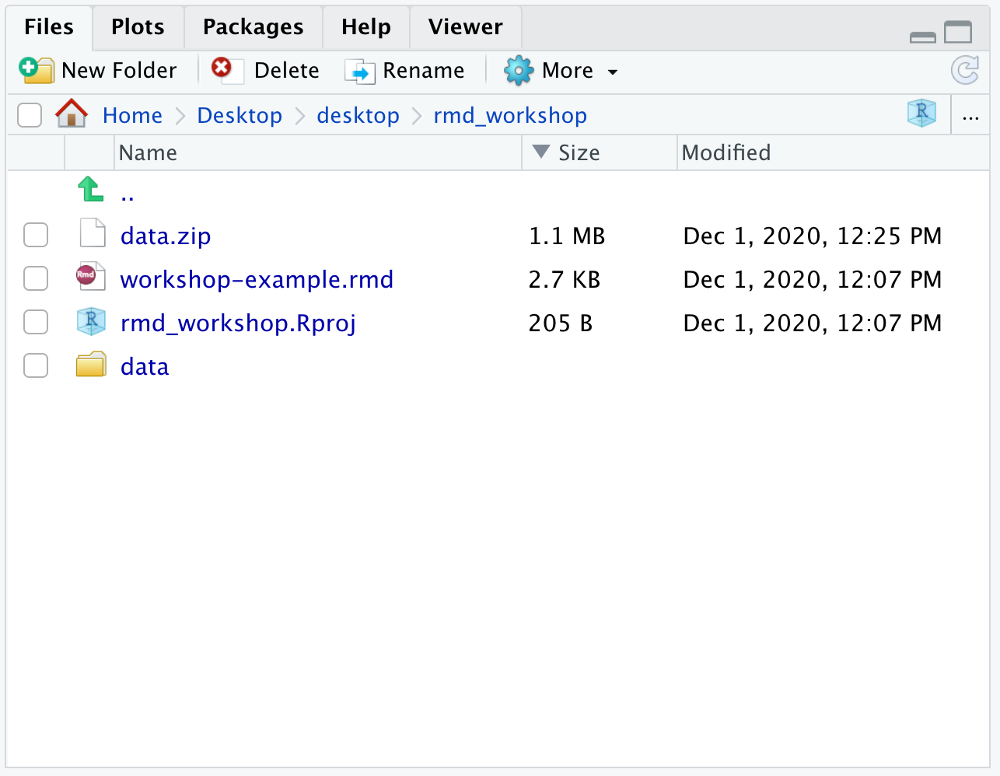
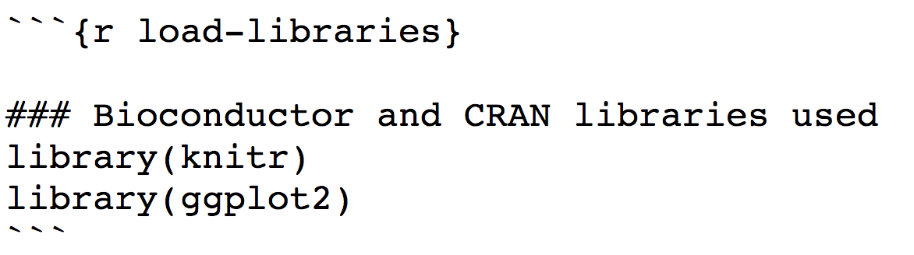

## Learning Objectives

* Describe the need for reproducible research 
* Create RMarkdown reports for sharing analysis methods, code and results

## Making your research reproducible
 
We have already made a case about reproducibility in the introduction to this workshop. In this lesson we will focus on one of the tools to enable and empower you to perform analysis reproducibly. 

When you do lab work, you use lab notebooks to organize your methods, results, and conclusions for future retrieval and reproduction. The information in these notebooks is converted into a more concise experimental description for the Methods section when publishing the results. Computational analysis requires the same diligence! The equivalent of a lab notebook for computational work is a detailed log of the workflow used, the tools at each step, the parameters for those tools and last, but not least, the versions of the tools. 

<p align="center">

</p>

*Image source: Peng 2011 https://doi.org/10.1126/science.1213847*


## RMarkdown

Creating the "gold standard" code is not always easy depending on what programming language you are using. For analyses within R, RStudio helps facilitate reproducible research with the use of R scripts, which document all code used to perform a particular analysis. However, we often don't save the version of the tools we use in a script, nor do we include or interpret the results of the analyses within the script.

In the first part of this workshop we will be learning about **[RMarkdown](https://rmarkdown.rstudio.com/)**. RMarkdown is a file format in its most basic form, that can eventually be converted into a shareable document, e.g HTML, PDF and many others. It allows you to document not just your R (Python and SQL) code, but also enables the inclusion of tables, figures, along with descriptive text. **Thus resulting in a final document that has the methods, the code and interpretation of results all in a single document!** 

To elaborate, you write a file using the **Markdown language** and within it **embed executable R code chunks**. The code chunks are paired with **knitr syntax**, so that once your document is complete, you can easily convert it into one of several common formats (i.e. HTML, PDF, PPT) for sharing or documentation.


<p align="center">

</p>

*Image source: [Applied R code](http://applied-r.com/project-reporting-template/)*

***Wait, what?*** 

Did most of that last paragraph and the workflow image seem like they were written in a foreign language? Don't worry, **the goal of this lesson is to cover each of those concepts in much more detail**! By the end of the lesson, you can come back to that paragraph and the workflow image above and will know exactly what it means.

Ready to get started?

---

### Exercise #1: Knit an RMarkdown file to generate an HTML document

Before we delve into the details, we will start with an activity to show you what an RMarkdown file (.Rmd extension) looks like, and how to generate the resulting HTML report using the `knit()` function (which is part of the R [knitr package](https://yihui.name/knitr/)).

1. Open up RStudio and **create a new project** in a new directory called `rmd_workshop`. Remember the location in computer where you create this project.
2. **Right click [this RMarkdown file](https://raw.githubusercontent.com/hbctraining/Training-modules/master/Rmarkdown/data/workshop-example.Rmd)**. Download it (using **Save Link As**) and place it within the `rmd_workshop` project directory.
3. **Download and uncompress [this data folder](../data/data.zip?raw=true)** within the `rmd_workshop` project directory.
4. **Open the .rmd file** in RStudio.
5. **knit the markdown** by clicking on the `Knit` button located at the top of your script editor pane.


In the console, you will see a flurry of text scrolling by. The text indicates progress while each code chunk is being executed. Once the document is finished 'knitting', a new window will be automatically opening up with the HTML report that was just generated. 

> **NOTE**: If you run into an error when knitting the markdown, make sure the directory structure of the `rmd_workshop` project is set properly as shown below:
> - The `data` folder should be in the same directory as `workshop-example.rmd` file
> - Two files (`counts.rpkm.csv` and `mouse_exp_design.csv`) are located inside the `data` folder
> <p align="center">
> 
> </p>

---

## RMarkdown basics

[Markdown](https://en.wikipedia.org/wiki/Markdown) is a lightweight markup language with **plain-text-formatting syntax**. It is often used for formatting README files, writing messages in online discussion forums, and creating *rich text* documents using a plain text editor. The Markdown language has been adopted by many different coding groups, and some have added their own "flavours". RStudio implements an **"R-flavoured markdown"**, or **"RMarkdown"**, which has really nice features for text and code formatting.

> The [RStudio cheatsheet for Rmarkdown](https://github.com/rstudio/cheatsheets/blob/master/rmarkdown-2.0.pdf) is quite daunting, but includes more advanced Rmarkdown options that may be helpful as you become familiar with report generation, including options for adding interactive plots RShiny.

### Components of a `.Rmd` file

Let's take a closer look at the "raw" `workshop-example.Rmd` file and understand the components therein.

**1. A file header in YAML format**
```
---
title: "Workshop Rmd example"
author: "HBC Training Team"
date: "`r Sys.Date()`"
output: html_document
---
```

This section has information listed in [YAML format](https://yaml.org/), and is usually used to specify metadata (title, author) and basic **configuration** information (output format) associated with the file. You can find detailed information about specifications that can be made in this section on [this webpage](https://bookdown.org/yihui/rmarkdown/html-document.html).

**2. Descriptive text**

```
## Project details
In this example report we are using a *toy dataset* to determine the impact of age, genotype and cell type on the average gene expression in mice. This toy study has 12 mice from **2 genotypes** (KO and Wt) and **2 cell types** (typeA and typeB). 

## Setup

### Load Libraries
```

The syntax for formatting the text portion of the report is relatively easy. You can easily get text that is **bolded**, *italicized*, ***bolded & italicized***. You can create "headers" and "sub-headers" to organize the information by placing an "#" or "##" and so on in front of a line of text, generate numbered and bulleted lists, add hyperlinks to words or phrases, and so on.

Let's take a look at the syntax of how to do this in RMarkdown:

<p align="center">

</p>

You can also get more information about Markdown formatting [here](http://rmarkdown.rstudio.com/lesson-1.html) and [here](http://rmarkdown.rstudio.com/authoring_basics.html).

> Fun fact! These lessons, and the schedule page were created using basic Markdown format (not R Markdown).
> Here's an example:
> <p align="center">
> 
> </p>

**3. Code chunks**



The basic idea behind RMarkdown is that you can describe your analysis workflow and provide interpretation of results in plain text, and intersperse chunks of R code within that document to tell a complete story using a single document. Code chunks in RMarkdown are delimited with a special marker (\`\`\`). Backticks (\`) commonly indicate a chunk of code. This syntax is also used for formatting text on [GitHub](https://github.com). 

Each individual code chunk should be given a **unique** name. The name should be something meaningful, and we recommend using [snake_case](https://en.wikipedia.org/wiki/Snake_case) for the names whenever possible. 

There is a handy `Insert` button within RStudio that allows you to insert an empty R chunk in your document without having to type the backticks etc. yourself. 

<p align="center">

</p>

Alternatively, there are keyboard shortcuts available as well.

* <kbd>Ctrl</kbd> + <kbd>Alt</kbd> + <kbd>i</kbd> **for PC users**
* <kbd>Command</kbd> + <kbd>option</kbd> + <kbd>i</kbd> **for Mac users**

Finally, you can write inline R code enclosed by single backticks (\`) containing a lowercase `r`. This allows for variable returns outside of code chunks, and is extremely useful for making report text more dynamic. For example, you can print the current date inline within the report with this syntax: `` `r Sys.Date()` ``. See how we implement this in the YAML header.

For the **final code chunk in your analysis, it is recommended to run the `sessionInfo()`** function. This function will output the R version and the versions of all libraries loaded in the R environment. Documenting the versions of the tools you used is important for reproduction of your analysis in the future.

### Generating the report

Once we have finished creating an RMarkdown file, we finally need to "knit" the report. You can knit the files by using the `knit()` function, or by just clicking on "knit" in the panel above the script as we had done in our first activity in this lesson. 

> Note that when creating your own reports, you will very likely find yourself knitting the report periodically as you work through rather than just once at the end. It is an iterative process usually since you may have to turn off warnings, or if you decide you need a figure to be larger/smaller, or updating the descriptive text in the document to be informative (for others and your future self).

When you click on the "knit" button, by default an HTML report will be generated. If you would prefer a different document format, this can be specified in the YAML header with the `output:` parameter as discussed above, or you can also click on the button in the panel above the script and click on "Knit" to get the various options as shown in the image under the 5th part of the exercise above.

> **Note**: *PDF rendering is sometimes problematic, especially when running R remotely, like on the cluster. If you run into problems, it's likely an issue related to [pandoc](http://pandoc.org).*

___

#### Exercise #2: Make additions to the Rmd file for a more complete report!

1. Scroll down to the end of the `workshop-example.Rmd` document. **Add a new code chunk.** Within the code chunk place the code `sessionInfo()`.
2. **Add a new section header** above the newly created code chunk. Use a title that best describes the output. Have this header be the same size as the "Project details" header.
3. **Modify the `author` and `title`** parameters at the top of the script to have your name and your chosen title
4. **Knit the markdown**. 

[Answer Key](https://raw.githubusercontent.com/hbctraining/Training-modules/master/Rmarkdown/data/workshop-answer-activity3.Rmd)

***

*This lesson has been developed by members of the teaching team and Michael J. Steinbaugh at the [Harvard Chan Bioinformatics Core (HBC)](http://bioinformatics.sph.harvard.edu/). These are open access materials distributed under the terms of the [Creative Commons Attribution license](https://creativecommons.org/licenses/by/4.0/) (CC BY 4.0), which permits unrestricted use, distribution, and reproduction in any medium, provided the original author and source are credited.*
