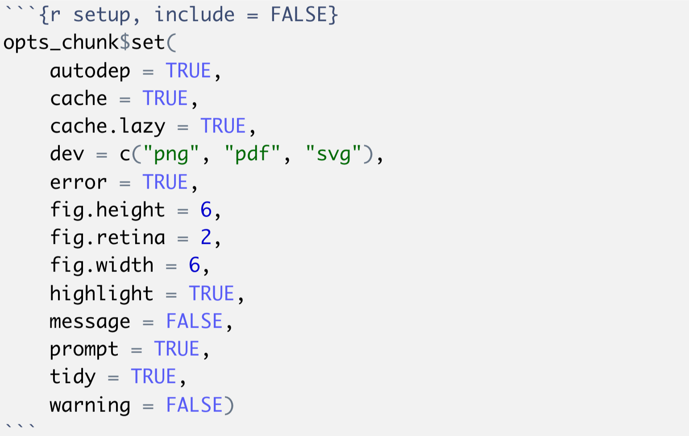

## Learning Objectives
* Detail the many options for code chunk evaluation 
* Describe how to add figures and tables to an RMarkdown
* Describe how to specify the output format for RMarkdown


## So many options for code chunks!

There are By this point, we have mentioned the word "knit" quite a few times, and you have installed the `knitr` package too. But, we have not yet fully defined what it is. [knitr](https://yihui.name/knitr/) is an R package, developed by [Yihui Xie](https://yihui.name), designed to convert RMArkdown and a couple of other formats into a final report in HTML or PDF or other formats. 

The knitr package provides a lot of customization options for code chunks embedded within the file. These options are written in the form of `tag=value`.


There is a [comprehensive list](https://yihui.org/knitr/options/) of all the available options, however when starting out this can be overwhelming. Here, we provide a short list of some options commonly used in code chunks:

* `echo = TRUE`: whether to include R source code in the final knitted document. If echo = FALSE, R source code will not be written. But the code is still evaluated and its output will be included in the final document.
* `eval = TRUE`: whether to evaluate/execute the code.
* `include = TRUE`: whether to include R source code and its output in the final document. If include = FALSE, nothing (R source code and its output) will be written into the final document. But the code is still evaluated and plot files are generated if there are any plots in the chunk.
* `warning = TRUE`: whether to preserve warnings in the output like we run R code in a terminal (if FALSE, all warnings will be printed in the console instead of the output document).
* `message = TRUE`: whether to preserve messages emitted by message() in the final output document (similar to warning).
* `results = "asis"`: output as-is, i.e., write raw results from R into the output document instead of LaTeX-formatted output. Another useful option for this option is "hide", which will hide the results, or all normal R output.


### Global options

`knitr` also allows for global options, which means choosing **options that apply to all code chunks in an RMarkdown file**. These will be the default options used for all the code chunks in the document, unless a modification is specified in an individual code chunk.

Global options should be placed inside your `setup` code chunk. The **`setup` chunk is a special knitr chunk that should be placed at the start of the document**. We recommend storing all `library()` loads required for the script in this `setup` chunk too! 



> **NOTE:** An additional cool trick is that you can save `opts_chunk$set` settings in a hidden file called `.Rprofile`. This file is located in your home directory and accessed by RStudio everytime your open up a new session. By setting this up, these knitr options will apply to all of your RMarkdown documents that you create.

___

#### Exercise #3

1. Only some of the code chunks in the `.rmd` file have names; go through and **add names to the unnamed code chunks**.
2. For the code chunk named `data-ordering` do the following:
    - First, **add a new line of code** to display first few rows of the newly created `data_ordered` data frame. You may use `head()` function here.
    - Next, **modify the options** for (`{r data-ordering}`) such that in the knitted report, the output from the new line of code will show up, but the code is hidden.
3. Without removing the second-to-last code chunk (`{r boxplot}`) from the Rmd file, **modify its options** such that neither the code nor its output appear in the report
4. **knit the markdown** 

[Answer Key](https://raw.githubusercontent.com/hbctraining/Training-modules/master/Rmarkdown/data/workshop-answer-activity2.Rmd)

___

### Figures

A neat feature of knitr is how much simpler it is to generate and add figures to a report! For the most part, you don’t need to do anything special, just add a code chunk that generates a figure. When the file is knit, the figure will automatically be produced and inserted into the final document. A single chunk can support multiple plots, and they will be appear one after the other below the chunk. 

There are a few code chunk options commonly used for plots. For example, to easily resize the figures in the final report, you can specify the `fig.height` and `fig.width` of the figure when setting up the code chunk.


In addition to displaying it in the report, you can also have `knitr` automatically write the files to a subfolder by using the code chunk option `dev`.

### Tables

`knitr` includes a simple but powerful function for generating stylish tables in a knit report named `kable()`. Here's an example using R's built-in `mtcars` dataset:

```r
help("kable", "knitr")
mtcars %>%
    head %>%
    kable
```

|                   |   mpg|  cyl|  disp|   hp|  drat|     wt|   qsec|   vs|   am|  gear|  carb|
|-------------------|-----:|----:|-----:|----:|-----:|------:|------:|----:|----:|-----:|-----:|
| Mazda RX4         |  21.0|    6|   160|  110|  3.90|  2.620|  16.46|    0|    1|     4|     4|
| Mazda RX4 Wag     |  21.0|    6|   160|  110|  3.90|  2.875|  17.02|    0|    1|     4|     4|
| Datsun 710        |  22.8|    4|   108|   93|  3.85|  2.320|  18.61|    1|    1|     4|     1|
| Hornet 4 Drive    |  21.4|    6|   258|  110|  3.08|  3.215|  19.44|    1|    0|     3|     1|
| Hornet Sportabout |  18.7|    8|   360|  175|  3.15|  3.440|  17.02|    0|    0|     3|     2|
| Valiant           |  18.1|    6|   225|  105|  2.76|  3.460|  20.22|    1|    0|     3|     1|

There are some other functions that allow for more powerful customization of tables, including `pander::pander()` and `xtable::xtable()`, but the simplicity and cross-platform reliability of `knitr::kable()` makes it an easy pick.

### Generating the report

Once we have finished creating an RMarkdown file, we finally need to knit the report. You can knit it by using the `knit()` function, or by just clicking on "knit" in the panel above the script as we had done in our first activity in this lesson. 

> Note that when creating your own reports, you might find yourself knitting the report periodically as you work through it, rather than just once at the end. 

When executing `knit()` on a document, by default this will generate an HTML report. If you would prefer a different document format, this can be specified in the YAML header with the `output:` parameter. You can also click on the button in the panel above the script and click on "Knit" to get the various options as shown below:


> **Note**: *PDF rendering is sometimes problematic, especially when running R remotely, like on the cluster (Cannon or O2). If you run into problems, it's likely an issue related to [pandoc](http://pandoc.org).*

The [RStudio cheatsheet for Rmarkdown](https://github.com/rstudio/cheatsheets/blob/master/rmarkdown-2.0.pdf) is quite daunting, but includes more advanced Rmarkdown options that may be helpful as you become familiar with report generation, including options for adding interactive plots RShiny.

___

#### Activity 4

1. **Download the linked [R script](https://github.com/hbctraining/Training-modules/raw/master/Rmarkdown/Rscript.R)** and save it within the `rmd_workshop` project directory.
2. **Download the linked [RData object](https://github.com/hbctraining/Training-modules/raw/master/Rmarkdown/data/Rmarkdown_data.Rdata)** by right-clicking and save it to the `data` folder within the `rmd_workshop` project directory.
3. Open the Rscript file, **transform the R script into a RMarkdown file** by clicking `File` -> `Rename`, and rename it as `Rscript.Rmd`. It is now a RMarkdown file.
4. **Make modifications** with the following specifications:
    - Create an R chunk for all code underneath each `#` comment in the original R script
    - Comment on the plots (you may have to run the code from the R script to see the plots first)
    - Add a floating table of contents at the beginning (refer to this [instruction](https://bookdown.org/yihui/rmarkdown/html-document.html#floating-toc), and make sure indentation is properly used)
4. **knit the markdown** 

[Answer Key](https://raw.githubusercontent.com/hbctraining/Training-modules/master/Rmarkdown/data/workshop-answer-activity4.Rmd)

***

> **Note1: output formats**
> 
> RStudio supports a [number of formats](http://rmarkdown.rstudio.com/formats.html), each with their own customization options. Refer to their website for more details.
> 
> The `knit()` command works great if you only need to generate a single document format. RMarkdown also supports a more advanced function named `rmarkdown::render()`, allows for output of multiple document formats. To accomplish this, we recommend saving a special file named `_output.yaml` in your project root. Here's an example from our [bcbioRnaseq](https://github.com/hbc/bcbioRnaseq) package:
>
> ```r
> rmarkdown::html_document:
>         code_folding: hide
>         df_print: kable
>         highlight: pygments
>         number_sections: false
>         toc: true
> rmarkdown::pdf_document:
>         number_sections: false
>         toc: true
>         toc_depth: 1
> ```

***

> **Note2: working directory behavior**
> 
> knitr redefines the working directory of an RMarkdown file in a manner that can be confusing. If you're working in RStudio with an RMarkdown file that is not at the same location as the current R working directory (`getwd()`), you can run into problems with broken file paths. Make sure that any paths to files specified in the RMarkdown document is relative to its location, and not your current working directory.
> 
> A simple way to make sure that the paths are not an issue is by creating an R project for the analysis, and saving all RMarkdown files at the top level and referring to the data and output files within the project directory. This will prevent unexpected problems related to this behavior.

***

## Summary
In this lesson, we learnt what is basic RMarkdown syntax, how to create code chunks, figures and tables, as well as how to generate report using `knitr` package. We also listed out some additional resources below for further study. Next time you work with R, start thinking about how RMarkdown could enhance your reproducibility research!

***

**Additional resources**
================

-   [knitr in a knutshell](http://kbroman.org/knitr_knutshell/)
-   [knitr book](https://www.amazon.com/gp/product/1498716962)
-   [knitr examples](https://yihui.name/knitr/demos)
-   [knitr vignettes](https://github.com/yihui/knitr/tree/master/vignettes)

***

*This lesson has been developed by members of the teaching team and Michael J. Steinbaugh at the [Harvard Chan Bioinformatics Core (HBC)](http://bioinformatics.sph.harvard.edu/). These are open access materials distributed under the terms of the [Creative Commons Attribution license](https://creativecommons.org/licenses/by/4.0/) (CC BY 4.0), which permits unrestricted use, distribution, and reproduction in any medium, provided the original author and source are credited.*
