## Learning Objectives

* Describe version control
* Implement version control on text file with Git using the GitHub Desktop interface


## Getting Started with Git using a GUI (Graphical User Interface)

Long-time users of Git often use the command-line user interface (CLI), i.e. a Terminal. However, there are several tools that enable novices to use Git with a Graphical User Interface (GUI) (point-and-click) interface. Two examples of GUIs for Git are [GitHub Desktop](https://desktop.github.com/) and [GitKraken](https://www.gitkraken.com). We will be using the former.

Although there are several advantages to using Git from the command-line interface in the long run, a GUI is a great place to start with learning the basics. 

> **A Note on Terminology**
> 
> One of the trickier aspects of using Git is the associated jargon (`repository`, `add`, `commit`, `pull`, `push`, `remote`, `detached head`). Some of the commands/terms are fairly self-explanatory, others less so, and in this workshop you will encounter both of these. [Here is a glossary of associated terms](https://help.github.com/articles/github-glossary/), however it is best to pick up terminology while learning how to use GitHub.

### Register for a GitHub Account

Since we are going to be using [GitHub](https://github.com/) along with [GitHub Desktop](https://desktop.github.com/) you will need to register for an account on GitHub if we don’t already have one. 

### Install GitHub Desktop

1.  After you have downloaded and installed GitHub desktop, open the application and click the `Sign in to GitHub.com` button

<p align="center">
    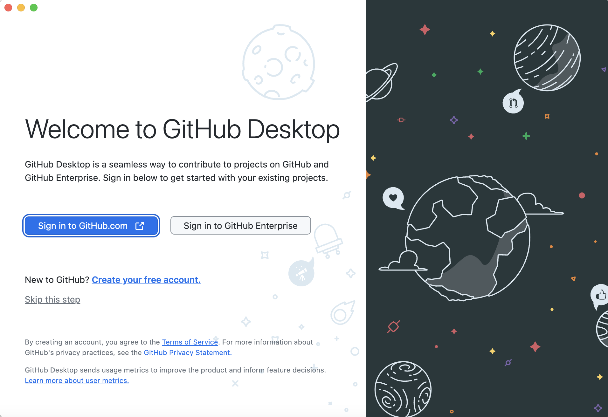
</p>

2. A browser window will open up prompting you to authorize a GitHub User. Sign in to Github or click `Continue` if you are already signed in. Depending on your browser, you may see a pop-up prompting you to open `Open GitHub Desktop`; if you agree you will see a follow-up message redirecting you back to the GitHub Desktop application

<p align="center">
    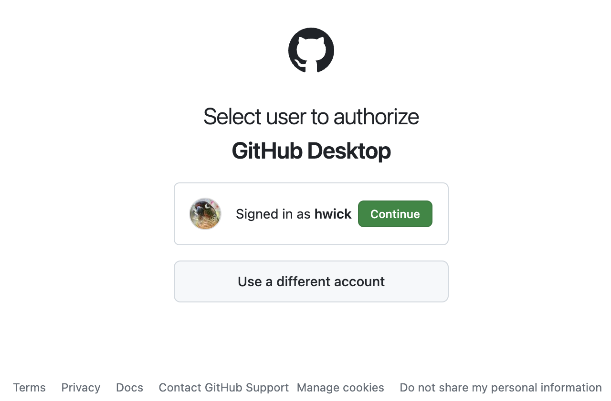
</p>

3. On GitHub Desktop, you will see a `Configure Git` prompt which will allow you to use your GitHub account name and email address or configure manually. You should select `Use my GitHub account name and email address` which should auto-fill your GitHub name/email, and click `Finish`

<p align="center">
    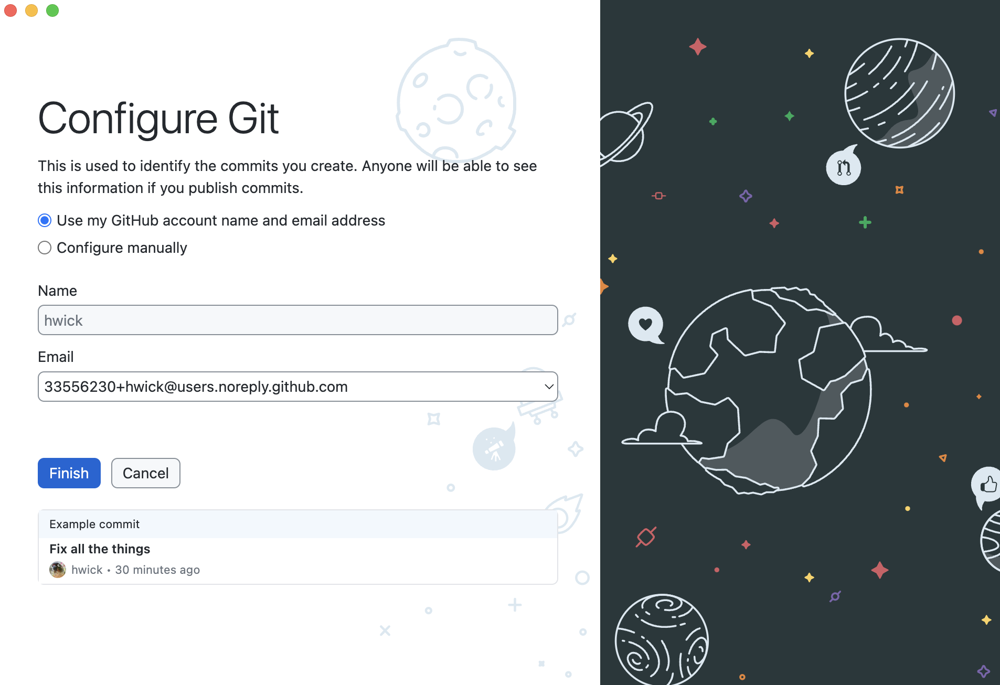
</p>

4. Then you will be directed to a `Let's get started!` prompt. If you already have repositories in your GitHub account, you should see them here. You will also see options to create and clone repositories. At this point, you've configured GitHub Desktop and are ready to start working with a *repository*.

<p align="center">
    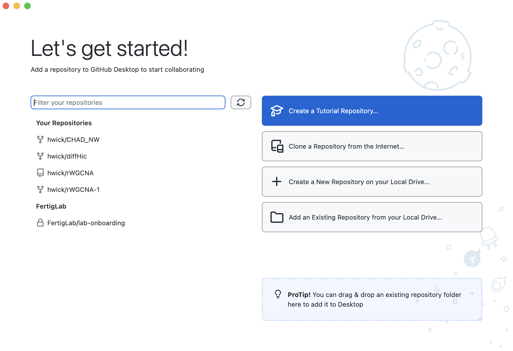
</p>

## Version Controlling a directory of files

### Creating a Repository

***So, what is a Git repository?***

*"A Git repository is the .git/ folder inside a project (folder). This repository tracks all changes made to files in your project, building a history over time. Meaning, if you delete the .git/ folder, then you delete your project’s history."* 
-adapted from [https://blog.axosoft.com/learning-git-repository/](https://blog.axosoft.com/learning-git-repository/)

Essentially, a (project) folder is chosen to be tracked and a Git repository is initiated within it; this ensure that the contents, and the changes to the contents within that folder will be "watched" by Git.

A few salient features of repositories are listed below:
* A repository can have many files and sub-folders (basically, a normal folder).
* Best practice is to have a separate repository for each project.
* Do not create repositories for folders within a repository (avoid *matryoshka* repositories!).
* The changes made within repository folders are being "watched" by Git as mentioned above, but these changes have to be deliberately added to the repository in order to be version controlled or recorded.
* You can be control the items that Git is "watching". It is best practice to ignore very large datasets, or temp files.

Download the folder we have generated for this session [from here](https://github.com/hbctraining/reproducibility-tools/raw/master/data/example_files.zip), and unzip it in a location of your choosing. We recommend placing it on your Desktop for the duration of this workshop.

### Creating a Folder/Repository, Starting from your Local Machine

There are a number of different ways to add files/folders for Git/GitHub Desktop to track...

**Method 1: In GitHub Desktop, on the `Let's get started!` screen, click `+ Crete a new repository on your Local Drive...`**

**Method 2:** In GitHub Desktop, if you are already past the `Let's get started!` screen, click `Current repository` in the lefthand side of the repository bar, then in the dropdown menu that appears, click `Add` and select `Create New Repository...`

**Method 3:** In GitHub Desktop, click `File` in the Menu Bar, then select `New Repository...`

**Method 4:** You can also add an existing local repository starting with Method 2 or Method 3 but selecting `Add Existing Repository...` or `Add Local Repository` from the respective dropdown menus and providing the local path of the repository

For this tutorial, we will be using **Method 1**

When you create a new local repository, you will be greeted with this prompt:

<p>
    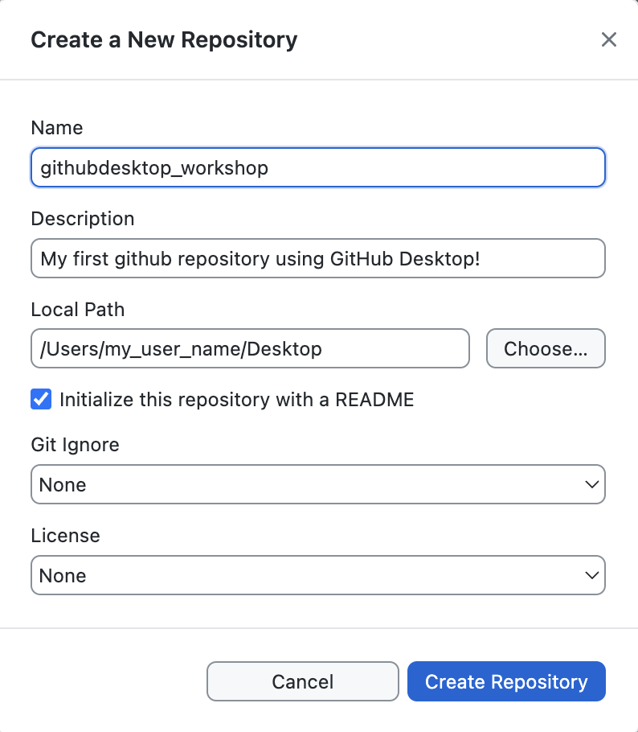
    <em>Create a New Repository</em>
</p>

Fill in the fields as appropriate:

1. The `Name` of the repository. Keep this to letters, numbers, and underscores; for this class, let's call it "githubdesktop_workshop".
2. Add a `Description` of what this folder/repository will contain.
3. Choose a `Local Path` where the repository will be stored on your computer. For this workshop, let's place the repo on your Desktop
4. If you want, you can Initialize the repository with a README by clicking the box. For now, we will leave this blank
5. If you would like to choose options for `Git Ignore` and `License`, there are options from the dropdown menu. For this workshop, we will select `None` for both.
6. Finally, click the `Create Repository` button.

**Make sure you follow all the steps and instructions listed above!**

>**More on `Git Ignore` and `License` options**
> * Selecting the **`Git Ignore`** option will create a hidden file caled .gitignore. This file allows you to specify if there are files which you would like to store in your local repository but not store in version control. You can learn more about ignoring files [here](https://docs.github.com/en/get-started/getting-started-with-git/ignoring-files)
> * The **`License`** option lets you add an open-source license to a LICENSE file in your repository. You can find out more about licenses [here](https://docs.github.com/en/repositories/managing-your-repositorys-settings-and-features/customizing-your-repository/licensing-a-repository)

Voila! You now have your first Git repo!

Your GitHube Desktop screen should now look like this:

<p>
    
</p>

### A quick tour of the GitHub Desktop interface
**The black bar on the upper part of the screen is called the repository bar, which has 3 sections:**

**Current Repository** (left) shows name of the current repository, which is the new repository you just created. If you click here, you'll see a dropdown menu to create and navigate between repositories. 

**Current Branch** (middle) displays the current branch. If you click here, it will let you view and switch to different branches in your repository (these will be visible once you create *pull* requests in your repository) or create a new branch. 

**Publish repository** (right). This option appears because we haven't yet published our repo to the GitHub Server, which we'll do later on in the lesson. This part of the repository bar will change depending on the status of your current branch and repository.

**On the left side of the screen you will also see two tabs:**

**Changes** will show you changes made to files in your current directory that haven't been committed to your local repository. This tab also has "Summary" and "Description" text boxes to describe your changes, and a **Commit to BRANCH** button, which will tell you which branch you are committing to. In this case the BRANCH should be "main", so it should say **Commit to main**.

**History** will show past commits you've made to the current branch of your repository. For now, you'll only see the **Initial commit** from creating the repository. You will also see any changes to files you created during the commit; in our case, we see there is a *README.md* as well as a *.gitattributes* file. Our *.gitignore* and *LICENSE* files would also appear here if we opted to create those during the initial commit. When you click on these files, you can see the *diff* -- only the parts of the file that changed are displayed. For the initial commit, that's all of the file.

> **Note 1:** The folder should also appear on your Desktop! If you can't find your folder, you can click on `Show in Finder` in the "View the files of your repository in Finder" section on the main screen
>
> **Note 2:** files like *.gitattributes* or any files which start with a `.` are hidden files, so they may not be visible in your Finder window by defualt. To view hidden folders in Mac OSX, you can press `Command+Shift+.`

### Committing Changes

Before we continue, we want to highlight a few research data management best practices: organize your files, structure your folder and name files consistently. We recommend having separate folders for `code` (or `scripts`), `data`, `docs`, `figures`, and `other` to keep your data organized.

You can make folders in your local GitHub repository just as you normally would in `Finder`, such as by right clicking and selecting `New Folder` from the drop down menu. 

For this workshop, we will add folders (and some files) to our repository. In order to do download the examples that we will be working from, left-click [this link](https://github.com/hbctraining/reproducibility-tools/raw/master/data/githubdesktop_workshop_materials.zip) and select "**Save File As...**" or "**Download Linked File As..**" from the dropdown menu. This should download a zip-compressed (`.zip` file) of the directory that we will be using. You can double-click on the `githubdesktop_workshop_materials.zip` file to uncompress it. Once this has directory has been uncompressed, move the individual folders within this folder into your GitHub Desktop repository within your file browser.

>**Note: only move the folders _inside_ of `githubdesktop_workshop_materials`, but do not move the parent `githubdesktop_workshop_materials` folder itself or the `util_functions.R` or `Pi Formulas -- from Wolfram MathWorld.pdf` files in that folder -- we will get to those file later**

In Finder, your repository should look like this:

<p>
    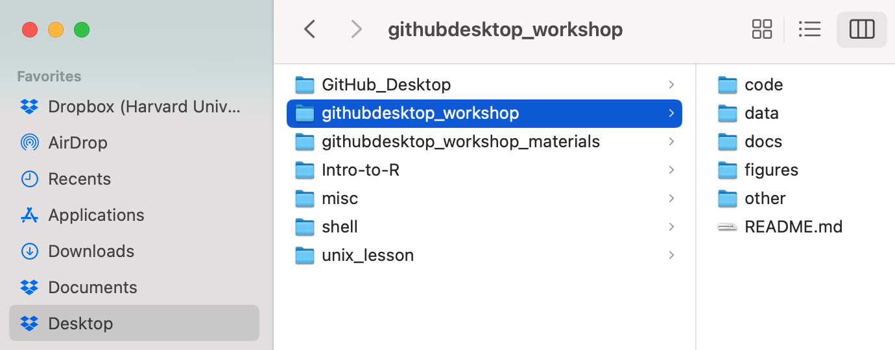
</p>

Now, look in your GitHub Desktop application. You can see that these folders and files actually show up on the left hand panel, ready to be committed to your repository:

<p>
    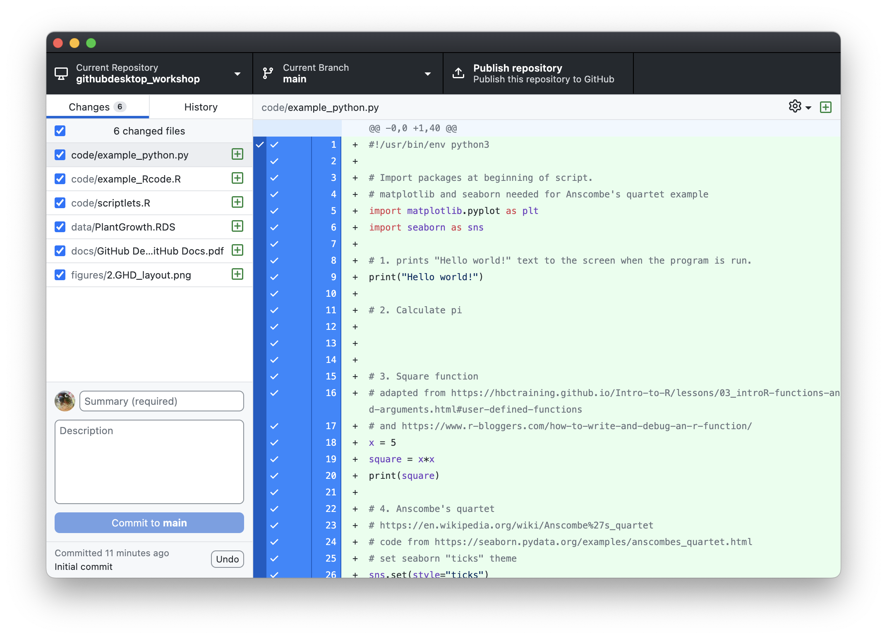
</p>

You'll notice that GitHub Desktop will actually show you any changes you made to these files on the right hand side of the panel. You can click on each file to review these changes.

>Note: Wait a minute, where is the `other` folder? Git will ignore folders that are empty. If you would like to make sure Git recognizes an empty folder, you can put a file in it. If you don't want to clutter your empty folders, you can put a hidden file  with a name starting with a `.`, such as `.gitkeep`, in the folder. 

>Note: To the right of each file, you'll see a `+` in a box. This indicates that these are newly added files. If you were to delete a file, you would see a `-`, and if you modify an existing file, you'll see a `dot`

These changes have been noted, but this new *version* of the repository is not yet recorded (saved) by Git. A **commit** tells Git that you made some changes which you want to record. Though a **commit** seems similar to saving a file, there are different aims behind ‘committing’ changes compared to saving changes. **Commits** take a snapshot of the file(s) at that point. You can actually record or commit modifications to multiple files/folders at once. i.e. single commit can have multiple updates.  

Committing changes usually happens in 2 stages:
1. `add` or stage one or many modifications incrementally
2. `commit` them with a special commit message to document the type of updates

GitHub Desktop automatically **adds**, or **stages**, any changes we make to the repository and displays them on the left hand side of the application. You have the option of excluding any of these changes from the **commit** by deselecting the check box to the left of each file.

To **commit** these changes one **must give a summary of the changes** in the `summary` box at the bottom of the left panel, followed by clicking on the <code>Commit to <b>main</b></code> button. You can also add a longer description, but this is optional.

After the commit, your screen will return to how it looked before, but it will tell you the name and how recently you made your last commit. The changes to your files will no longer be displayed, because they have been committed. You'll have an option to `undo` the commit in the bottom left if you'd like to go back.  Here is how your GitHub Desktop application will look after your first commit (in this case, the summary was `My first commit!`:

<p>
    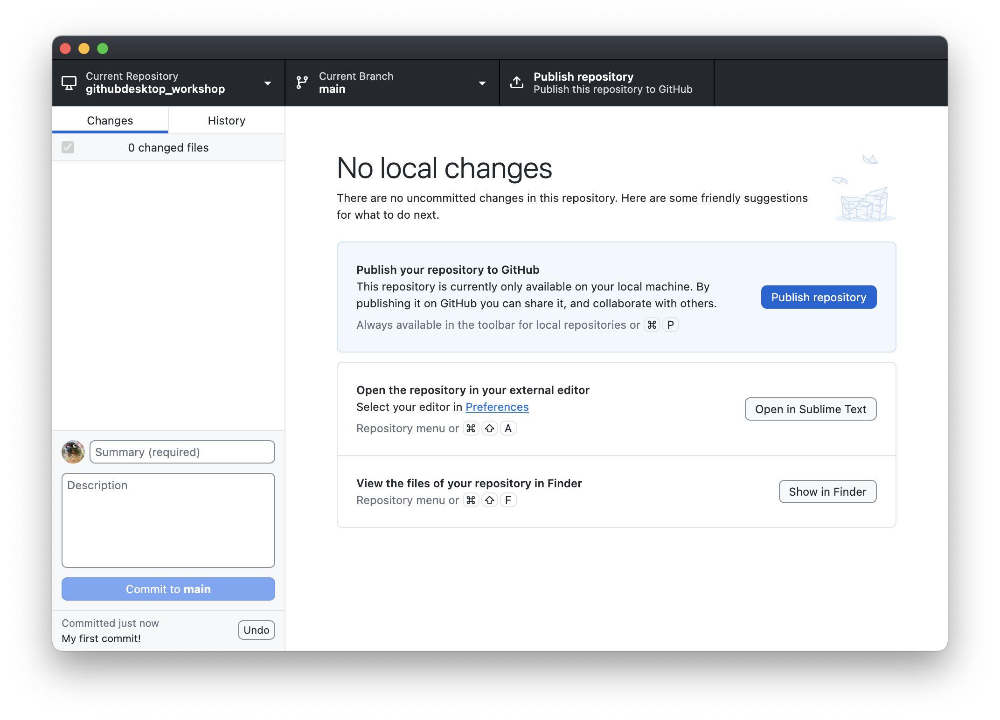
</p>


A useful way to think about commits is as the ‘history’ of your project. Each commit records a development or change made to the documents in your repository; the history of the project can be traced back by looking at all of the commits. You can directly view this `History` by clicking on the `History` tab on the left hand side of the application:

<p>
    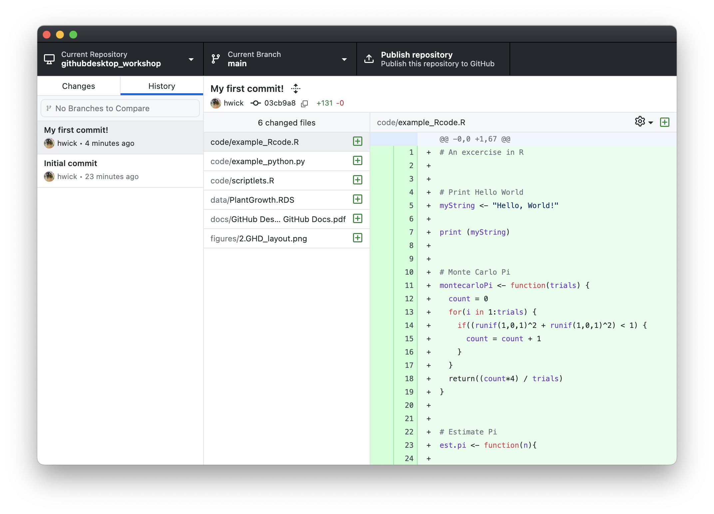
</p>


* Think carefully about when to make commits, since the advantages of version control rely on taking snapshots of your changes regularly.
* Make the commits "atomic", i.e. **commit a few related changes together**; this will help if you have to revert back to a specific version/snapshot. 
* Use meaningful **commit summaries** and **messages**, so that your messages/summaries are independently understandable by your collaborators and your future self.

> **Note about Branches**:
>
> When you commit you will see <code>commit to <b>main</b></code>. This refers to the **main** branch. 
> 
> Within a Git repository it is possible to have multiple ‘branches’. These different branches are essentially different (virtual) places in which to work. Often they are used to test new ideas or work on a particular feature without modifying or "contaminating" the master copy (e.g. production version of a webpage). This feature is very useful when collaborating with others. We do not have time to go into this aspect of Version Control in this workshop, but we encourage you to explore it further.

### Changing File Contents and Committing Changes

We're going to make several sets of changes that reflect the flexibility and capability of a version control system. 

Let's open the `README.md` document using our favorite text editor (see note below about text editors) and make this more useful. The information in this document is displayed at the bottom of the main page of your repo when you view it on GitHub (online). The `.md` extension means that this is a text file in ["markdown" format](https://guides.github.com/features/mastering-markdown/), which GitHub automatically renders into readable HTML pages.

> README files are an essential part of any analysis workflow, so that your future self or your collaborators are able to understand what they need to know. Git and Github encourage this practice for every repository. [Click here to learn more about README files associated with biomedical datasets/analyses](https://datamanagement.hms.harvard.edu/readme-files).

To open your README.md file, you can either click on it directly in Finder, or you can click the `Open in Sublime Text` (or other text editor if that's your preference) button in the `Open the repository in your external editor` box in the middle of your screen. This will open the whole repository within Sublime Text, and you can select your README file within the editor from the menu on the left.

Let's turn our `README.md` file for this Git repository into something more meaningful by adding some boilerplate text and helpful information to the small amount of text already there:

```
## Overview
Our code will demonstrate the different code snippets that have been used for programming
classes. We will have this written in both R and Python. 

## Installation
The full suite of code will require the Tmisc and dplyr R packages; 
matplotlib and seaborn for Python

## Usage
Simply fire up RStudio for trying out your R code, or Spyder for your Python code.

## Getting help

## Contributors
Contributions and references are included in the source code files.

## References
Contributions and references are included in the source code files.

## Licensing
This is all available as CC BY 4.0 license. Enjoy!
```

Save the changes to your file.

Let's also open the `scriptlets.R file`. You'll notice we have some template text there as well -- great for reminding you what you need to do when starting to code. Let's flesh out this file by adding these example functions and replacing everything in the file before `# main code` in the original file. Copy & paste this code:

```
#!/usr/bin/env Rscript

# This script will include a collection of small scripts steps
# often seen as example code. We're using this solely for demo purposes

# Put globals, installs, and sources here
source("./util_functions.R")

# Put functions here
# 1. Prints hello world

myString <- "Hello, World!"

print (myString)


# 2. Square function
# adapted from https://hbctraining.github.io/Intro-to-R/lessons/03_introR-functions-and-arguments.html#user-defined-functions
# and https://www.r-bloggers.com/how-to-write-and-debug-an-r-function/

square_it <- function(x){
  sq <- x*x
  return(sq)
}

square_it(5)


# 3. Monte Carlo Pi

for (trials in 1:3000) {
  count = 0
  for(i in 1:trials) {
    if((runif(1,0,1)^2 + runif(1,0,1)^2) < 1) {
      count = count + 1
    }
  }
  print(paste(trials, ": ", (count*4) / trials))
}


# main code
```

Save this file as well, and go back to GitHub Desktop. You'll see that your README.md and scriptlets.R files are in the left hand panel with the modified indicator to the right of the file: 

<p>
    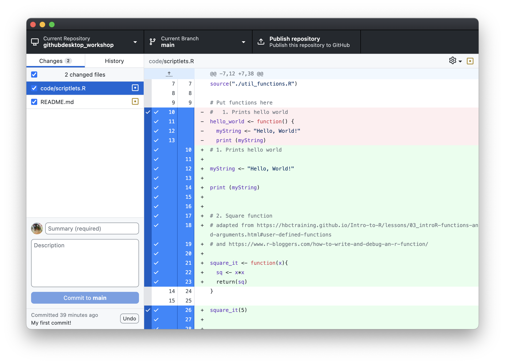
</p>

If you click on these files, you can review the changes you've made. For text-based files, anything highlighted in green is being added to the file, while anything highlighted in red is being removed from the pre-existing file. Anything unchanged will not be highlighted.

As before, this is GitHub Desktop's way of **adding**/**staging** these changes, but they haven't yet been recorded in an official `snapshot` of your repository. To **commit** these changes to your repository and make an official record of them, you'll need to add a summary and click `Commit to main`, just as we did before.

> **Text Editors:**
>
> When creating a plain text document, you will want to use a text editor like Atom, TextMate, TextWrangler, or Sublime Text (Mac) or NotePad++ (Windows) instead of Microscoft Word or the default text editors. You will also want to make sure that you save it as plain text. There are a [large number of free and paid text editors available](https://en.wikipedia.org/wiki/List_of_text_editors) to choose from. In a pinch, you can always use TextEdit (Mac) or Notepad (Windows).

In the context of GitHub Desktop when the application **stages** your changes in the local repository, it is similar to the **add** command on the command line interface. You can add several changes in the staging area, and only **commit** when you are ready. 

Since we wish to keep all the different types of changes as separate commits, we will first commit the documentation change to the README file, and then the code change in the Rscript file. 

First, deselect the `scriptlets.R` file so only the `README.md` file has a checkbox, and, as we did with our previous initial commit, include a summary message (you'll notice that GitHub Desktop has conveniently suggested `Update README.md` for us), and click on the Commit button:

<p>
    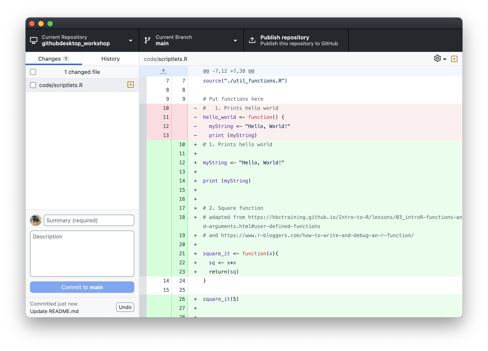
</p>

Again, you'll see this latest commit in the lower left hand corner. Now, select the changed R file and include a meaningful change message (feel free to use the one suggested by GitHub Desktop), and click `Commit to main`. You'll see the latest commit in the lower left again. 

But what if we want to see our previous commits? We can access all of our previous commits by clicking the `History` tab in the left hand panel:

<p>
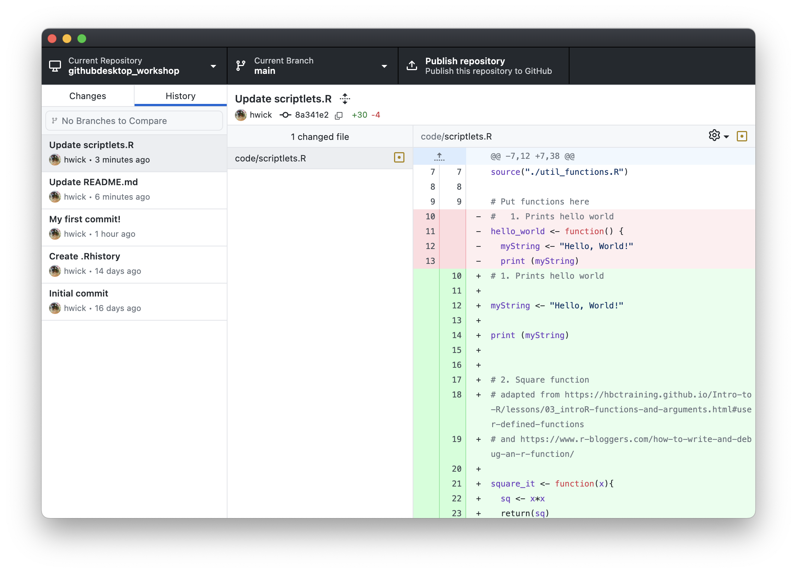
</p>

There may be times, however, when we wish to ensure that we save a coordinated set of changes. For example, if we want to make coordinated changes to multiple files it makes sense to make the changes and then stage (add) and commit all the updated files all together (**atomic commit**). 

Let's say we want to update the code in the `scriplets.R` file to the following wherein we want to use the `util_functions.R` in the code. Remember that the `util_functions.R` is the Rscript file we left behind in the `githubdesktop_workshop_materials` folder we had downloaded. 

1. Let's update the `scriplets.R` file with the following information and save it:

```R
#!/usr/bin/env Rscript

# This script will include a collection of small scripts steps
# often seen as example code. We're using this solely for demo purposes

# Put globals, installs, and sources here
source("./util_functions.R")

# Put functions here
#   1. Prints hello world
hello_world <- function() {
  myString <- "Hello, World!"
  print (myString)
}

# main code

hello_world()

square_it(10)

montecarloPi(3000)

# END
```

2. Now, let's move the `util_functions.R` script file from the `githubdesktop_workshop_materials` into the `code` folder in our new repo.

When we return to the GitHub Desktop application, it has noticed the two changes. Since the change in the main code file depends on the presence of this other file, we need to ensure this commit (snapshot) captures these inter-dependent changes. So, let's keep both files selected for staging, give a meaningful commit message reflecting this process, and then commit! 

<p>
    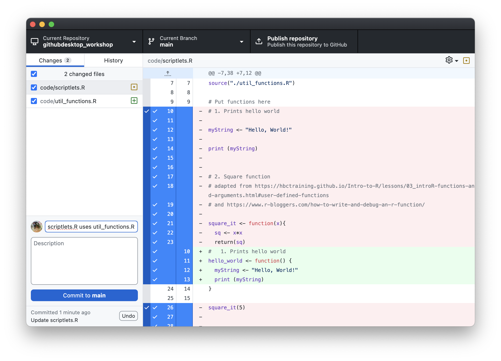
</p>

### Publishing your local GitHub repository remotely to github.com

One last thing: It's all well and done to have a GitHub repo on your computer, but to take full advantage of GitHub's tracking and sharing capabilities, we should publish our repository to github.com. To do so, simply click the `Publish repository` tab on the righthand side of the repository bar. A window will pop up which will allow you to make changes to the repository name and description, as well as choose the organization (the default is `None` which will publish the repository to your personal GitHub account). You can also select whether to keep the code private or make it public. Once you've made any changes, click the `Publish Repository` button:

<p>
    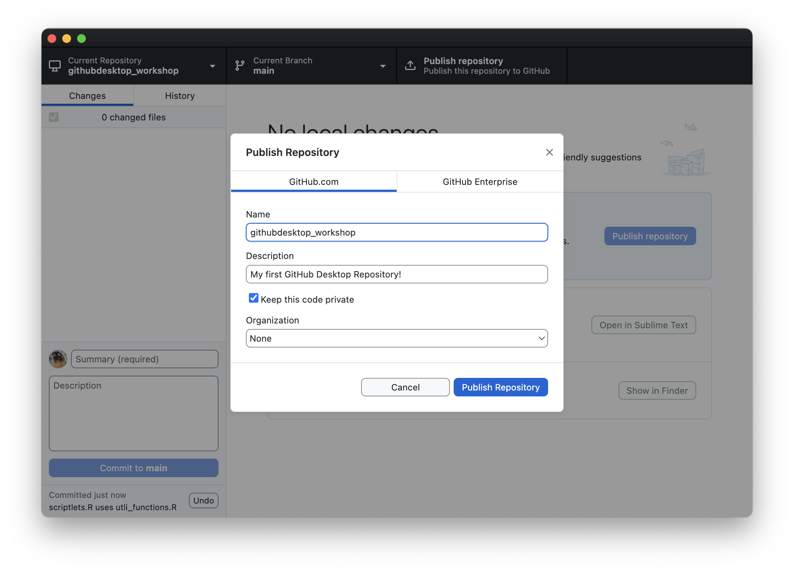
</p>

This will only take a moment. And you'll notice that the `Publish repository` tab in the repository bar now says `Fetch origin.` We'll cover the concept of Fetching at a later time.

If you go to your github.com profile page and click `Repositories` from the bar up top, you'll see your newly published github repository:


<p>
    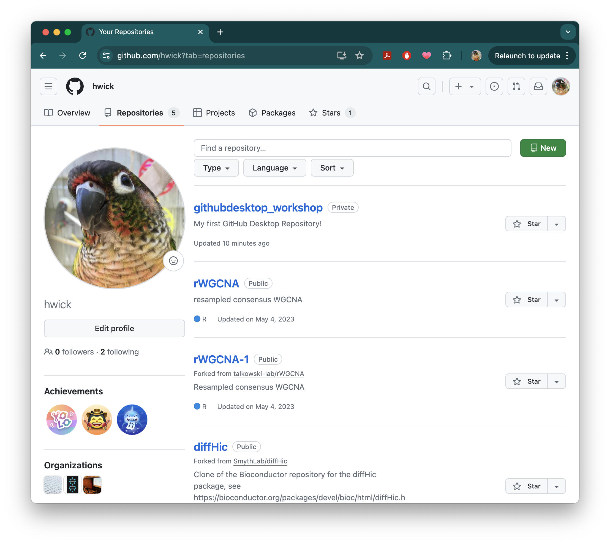
</p>

***

**Exercise #1**

1. Create a repository `learning_github` in GitHub Desktop. Make sure to create it both locally, and then publish it remotely on github.com.
2. Find the folder on your local computer, and add a couple of small text files to it from your computer. 
3. Create a new plain text file called `data-file.txt`, add a line or 2 of content to it and save it to the `learning_github` folder.
4. Go to GitHub Desktop, and commit the change with an approriate message.
5. Switch repos back to the `githubdesktop_workshop` repo.

***

* Materials used in these lessons are derived from Daniel van Strien's ["An Introduction to Version Control Using GitHub Desktop,"](http://programminghistorian.org/lessons/getting-started-with-github-desktop), Programming Historian, (17 June 2016). [The Programming Historian ISSN 2397-2068](http://programminghistorian.org/), is released under the [Creative Commons Attribution license](https://creativecommons.org/licenses/by/4.0/) (CC BY 4.0).*

* Materials are also derived from [Software Carpentry instructional material](https://swcarpentry.github.io/git-novice/). These materials are also licensed under the [Creative Commons Attribution license](https://creativecommons.org/licenses/by/4.0/) (CC BY 4.0).*
