## Learning Objectives
* Sync local and remote versions of a Git repository
* Make changes to git repository on GitHub (editing, adding files, deleting files)
* Sync local and remote versions of a Git repository
* Access version history of a given file or repository

## Repositories online (remote)

### Pushing Your Changes to Your Remote Repository

In the last lesson we were only recording our changes locally, but we may want to have these changes be available remotely as well (for collaborating/sharing/backing up). The idea is you keep your local and remote repositories "in sync".

At the end of the last lesson, we took the first step to synchronizing your repository locally and remotely by publishing it to GitHub's servers, but any further changes you make locally through GitHub Desktop will remain local and not appear remotely until they are **push**ed to GitHub's servers. Any time you make local changes, you might notice the right hand tab on the repository bar will say `Push origin`. `Origin` is the default name for your remote repository (it is possible to change the name, but that is beyond the scope of the lesson). Clicking this button will enact a one-way synchronization which will **push** your changes in your repository from your computer to the GitHub website, and populate the *remote* repository on GitHub's servers in the process.

At the end of the last lesson, we saw our repository on our *Repositories* tab on GitHub.com. If you click on your repository, we can now view our changes on our remote at GitHub.com (if you don't want to navigate there by hand, in GitHub Desktop you can go to `Repository` in the menu bar, then select `View on GitHub` and it will automatically open the repository on GitHub.com for you: 

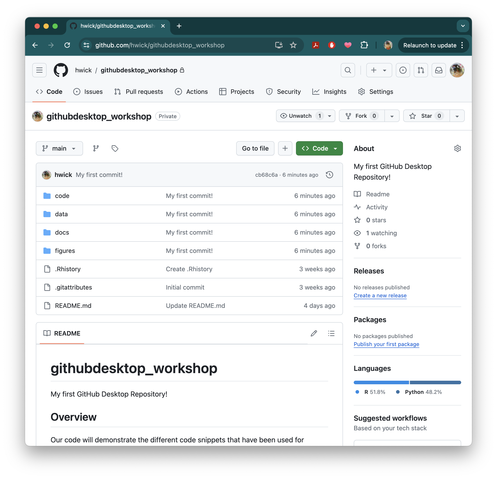

Notice that our short commit descriptions are shown here, and that we can see the different commits that we performed.

> You can also have a fully local repository, without a remote "synced" one on GitHub. 
> If you would like to initialize such a repository with this intention pick the "Local Only" option under "Init".

On Github, you can choose to keep repositories public or make them private; and if they are private, you can choose specific GitHub users with whom you want to share it or collaborate with.

Once your document is online, you can continue to make local changes to your file. But you will have to synchronize your local changes to reflect these changes in the published GitHub repository. GitHub stores changes both locally (on your computer) and remotely (on their servers), and it is important to keep these changes in sync. 

In GitHub Desktop and standard Git workflows, this is accomplished by regular, intentional rounds of **Pull** and **Push**, which both **pulls** in changes from the remote repository, and **pushes** any local changes to the remote repo.

## Making Changes Remotely

We now have our work both locally on our computers and online in the GitHub web interface. So far any edits we have made to our files have been directly on the local versions and then we pushed the changes to the online repository. It is also possible to **make a change to your repository on the web interface**. 

To demonstrate how to do this, we will edit one of the files in our **`code`** folder. Inside this folder we have several scripts and we realized that we forgot to give attribution to our functions in the `util_functions.R` file.

Navigate to the **githubdesktop_workshop** repository online in GitHub.

Go into the `code` directory, and click on the name of the file (`util_functions.R`) in the title area. This will take you to a new page showing your document.

Click on the 'Edit' option or the pencil icon in the top right-hand corner of the document. You will now be able to edit the file and add some new text. **We are going to make two edits to this file!**

1. We want to add some comments above the "Square function". This comment provides the resources from which we obtained and adapted this code. You can **copy the text provided below and paste it into your document**.

```
# Square function
# adapted from https://hbctraining.github.io/Intro-to-R/lessons/03_introR-functions-and-arguments.html#user-defined-functions
# and https://www.r-bloggers.com/how-to-write-and-debug-an-r-function/
```

2. Next, we will do a similar thing for the and the "Anscombe's quartet function". The **text you need to add is provided below**.

```
# Anscombe's quartet
# Examples from https://www.r-bloggers.com/using-and-abusing-data-visualization-anscombes-quartet-and-cheating-bonferroni/
```
<p align="center">

</p>

Once you have made some changes to your file, **click the green `Commit changes...` button** in the upper right hand corner of the screen. You will see the option to commit changes, and two associated text entry boxes. The first box is to give your commit a short description of the changes you made. The second box allows you to provide more detailed text about the commit, which is optional.

**Provide an informative description for your commit and then press "Commit changes"**.

<p align="center">
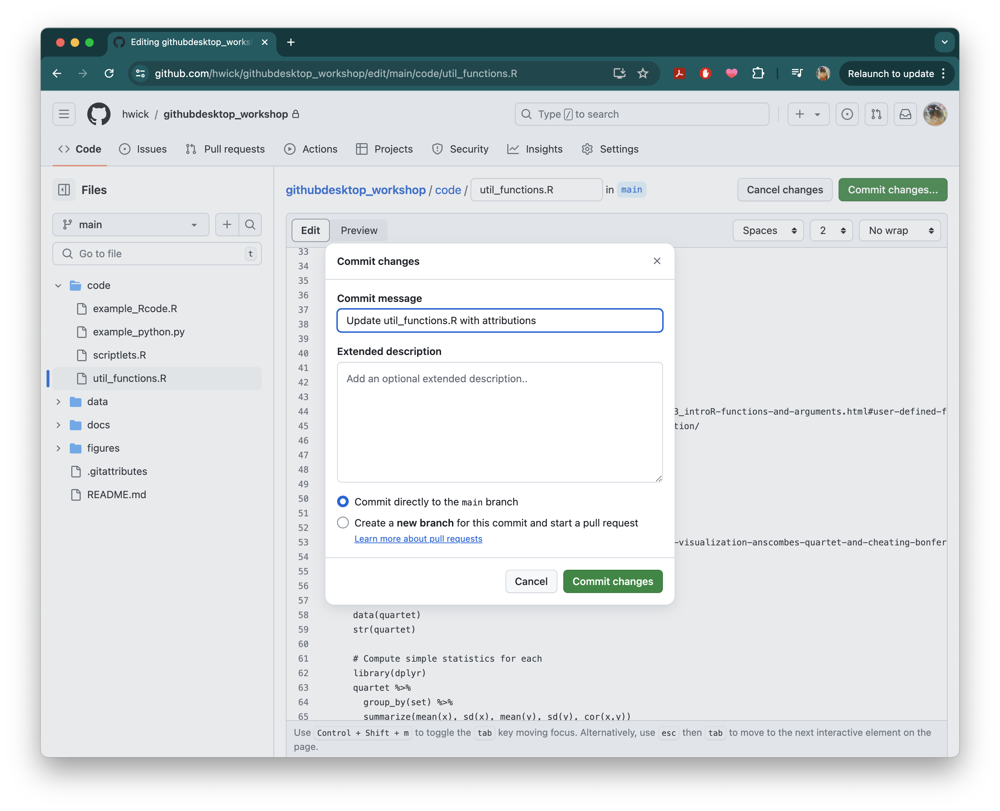
</p>

## Deleting files online

One can also add and delete files from the repositiory online. To do this, you will first need to view the file itself (by clicking on the file's name). Once you are viewing your file you will see a trash can icon at the top right-hand side, located to the right of the edit/pencil icon. 

Let's delete one of the files in our `code` folder. Since we're working in R, we will remove the python code file. Click on the `.py` file, then click the `...` button in the top right of the screen and select `Delete file`:

<p align="center">
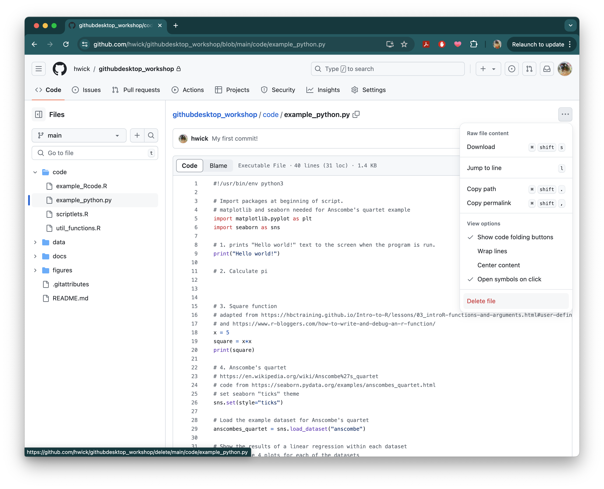
</p>

You will see the screen change, indicating that `This file was deleted`, but the action won't be complete until you **commit** the change; GitHub will track this change just like any other you might make to your repository. Click the green **Commit changes...** button in the upper right. Just as before, GitHub will ask for a commit description. **Provide a description** (or use the suggested one) **and commit this change**.

<p align="center">
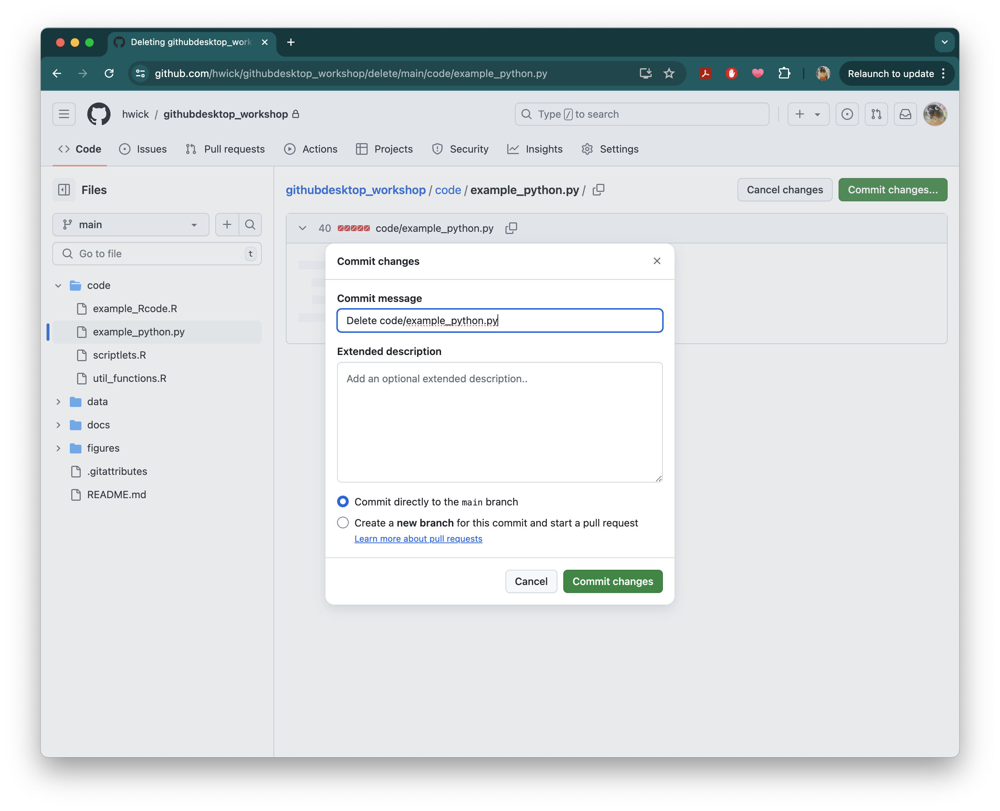
</p>

## Adding files to a repository online

We can also **add files and folders to the repository via the web interface**. There are two ways to do this, by uploading existing files or create new files directly in the interface.

### Uploading files

We'll start with adding files through upload. In your **github_desktop_workshop** repository on GitHub.com, navigate to the `docs` folder. On this page you will see all of its contents listed, and in the upper right you will see an `Add File` button. If you click on this, you will see two dropdown options appear: `Create new file` and `Upload files`. **Select `Upload files`**. This will take you to a new page.

> **NOTE:** The screenshot below is slightly outdated and does not accurately reflect the dropdown options described above. Please refer to the text above for the actual options.

<p align="center">
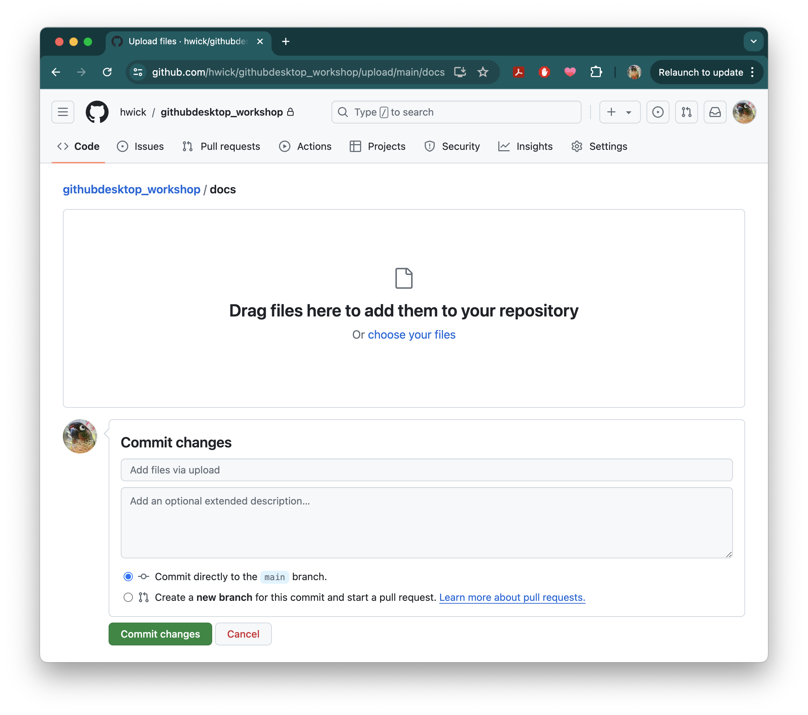
</p>
  
The file that **we would like to add to this folder** is called **"Pi Formulas -- from Wolfram MathWorld.pdf"**. The document is located in our **github_desktop_workshop_materials** folder which you downloaded and unzipped earlier. To add it to the repo using the web interface, you can do one of two things:

1. Find the file in a File Explorer window on your computer, and then drag and drop it on to this page.
2. Click on the "choose your files" and find/select the file in the window that pops up. 

Once the file is selected, the Upload will require a Description and subsequent Commit:

<p align="center">
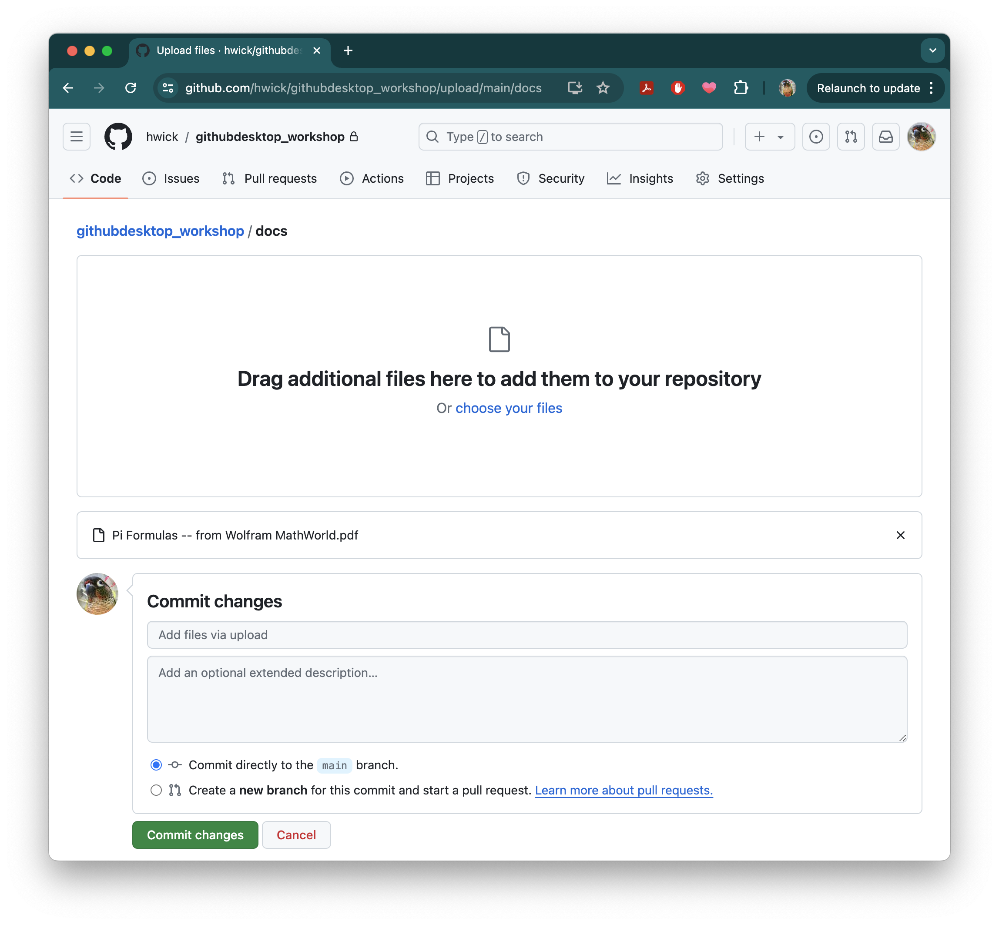
</p>

After committing, you will be brought back to the main page of your repository, and you'll see your latest commits. If you navigate to the `docs` folder, you should now see the `Pi Formulas...` document there.

<p align="center">
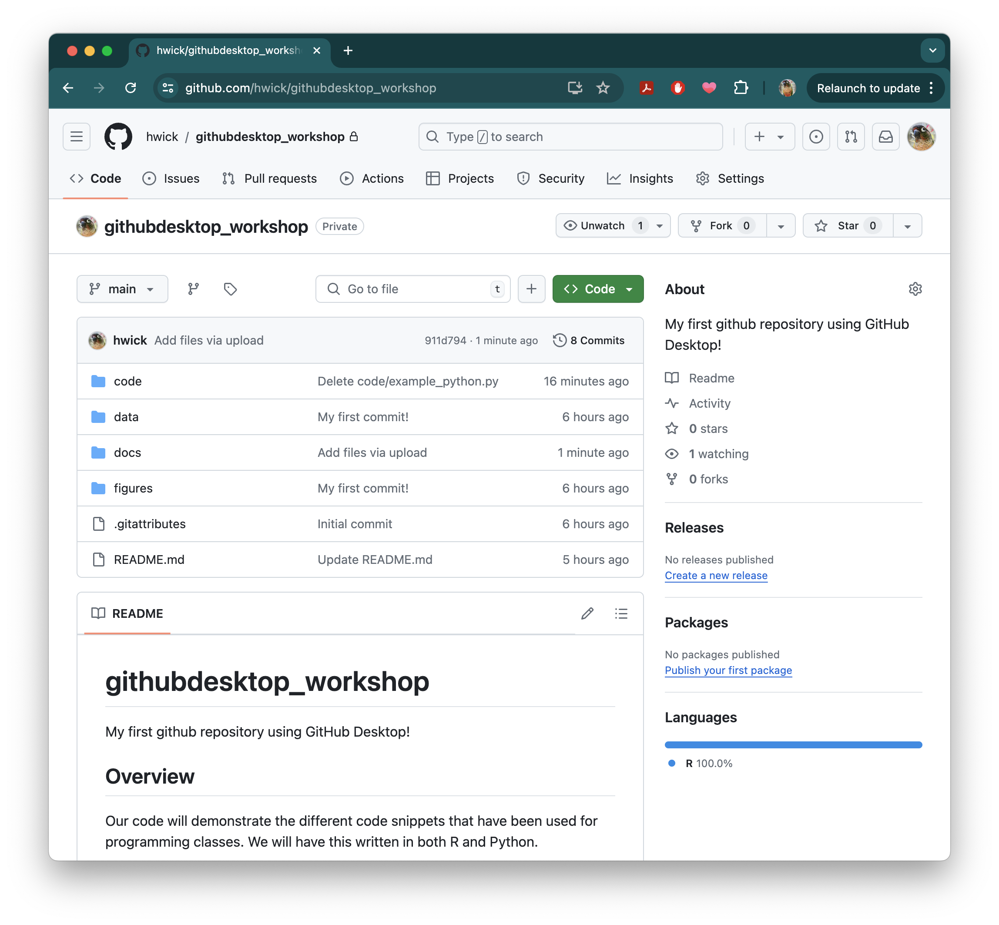
</p>

## Syncing remote changes to your local repository via Pull

Let's return to our local machine and apply the changes we made online to our local repo. GitHub Desktop has already noticed that our remote repo has changed, and is now prompting that you can `Pull 2 commits form the origin remote` which is highlighted in a blue box with a `Pull origin` button in blue (you can also see that the repository bar has a `Pull origin` option and tells you when the repo was most recently **fetched**.

> Note: **fetch** and **pull** are similar concepts with some important differences. When a repo is **fetched** from remote, it will note changes to your repo but not merge/commit them to your local directory. When you **pull**, it will note these changes **and** merge/commit them to your local directory.

<p align="center">
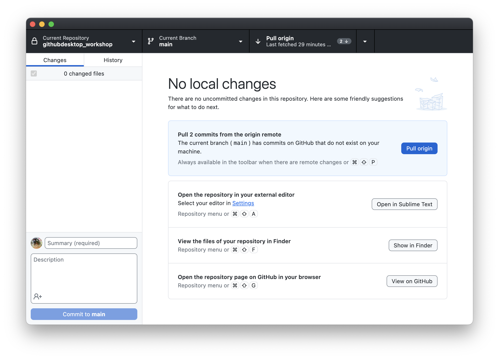
  </p>

Click on the **`Pull origin`** button, then navigate to the history tab to **view the commits** you just made via the GitHub website. You can click on individual files to see the changes you made:

<p align="center">

  </p>

As before, the changes to any text files are highlighted in <span style="color:green">green</span> and <span style="color:red">red</span>.

* <span style="color:red">Red</span> indicates where things have been removed
* <span style="color:green">Green</span> indicates addition of text 

Now that we've **pull**ed our changes from remote, you'll also be able to see any changes in your Finder directory for the repository.

> **NOTE**: Two important things to keep in mind when making changes on the web interface:
> * On GitHub.com file changes are done serially, so commits with modifications to multiple files cannot be done here.
> * All of these changes in the web browser are realtime on the GitHub remote, i.e. the commits take effect immediately without an intermediate **add** or **stage** step.

## Viewing File Histories

One very useful feature of GitHub and GitHub Desktop is the ability to see how a file has changed over time.

We've already seen how you can view changes made to files (highlighted in red and green) in GitHub Desktop in a given commit. It's also possible to view a file's entire history through GitHub.com

On the repository page on GitHub.com, navigate to the file whose history you would like to view. In this case, let's go to `scriptlets.R`. You'll notice in the upper right there is a `History` button with a symbol of a clock surrounded by an arrow:

<p align="center">
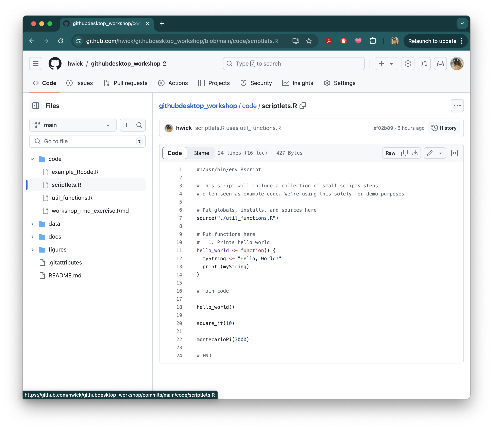
</p>

You can click this to see all commits which relate to this file:

<p align="center">
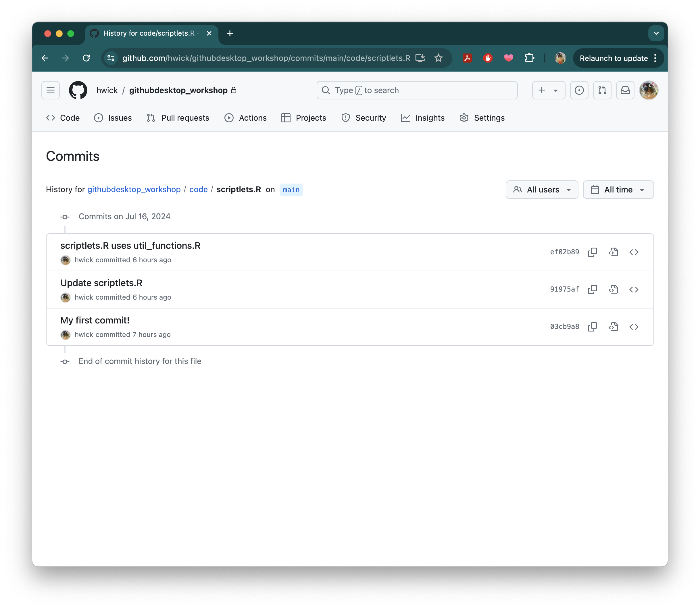
</p>

You'lll notice that for each commit, there are a series of icons on the right hand side. One looks like a **document with `< >`** and the other is simply **`< >`**. Clicking these icons let you see the version of the file in that commit, or the whole repo as it looked in that commit, respectively. Let's click on the icon to see the version of `scriptlets.R` from the `Update scriptlets.R` commit. Notice that in the upper left, the button that usually says `main` now has an alphanumeric code. This code represents a snapshot of your repo at the time of this commit:

<p align="center">
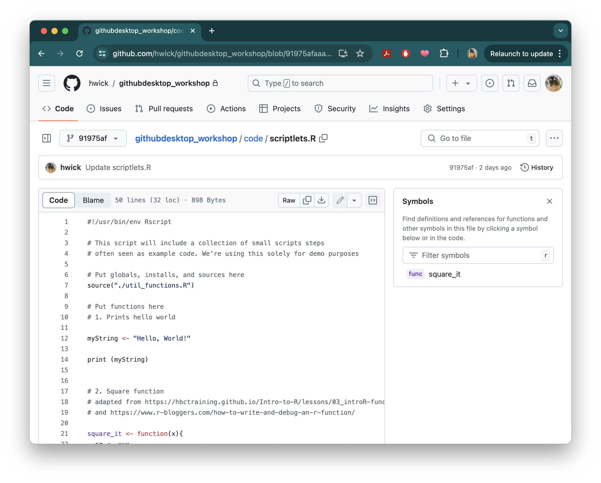
</p>

You can also see changes from specific commits leading up to/including the "current" (selected) commit by clicking on the `Blame` button in the upper left. It will also show you the author of the commit (useful if you are collaborating with someone on the project):

<p align="center">
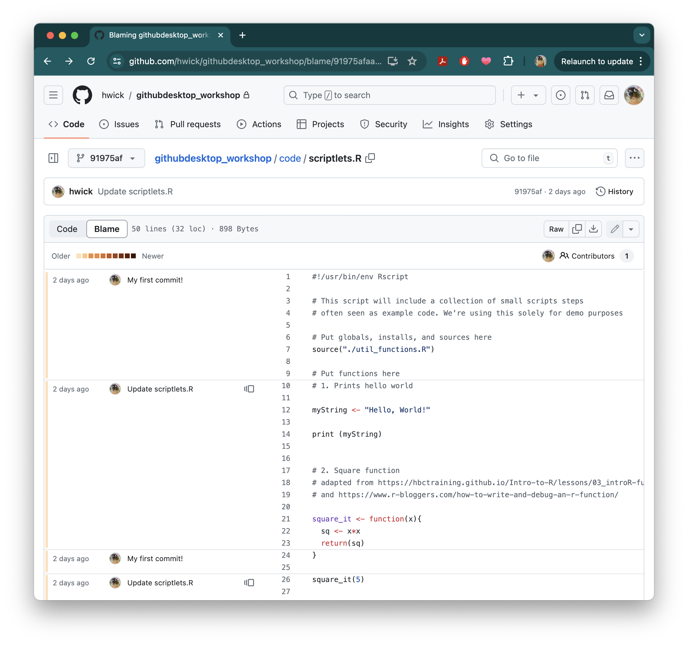
</p>

> Note: you do not have to be in `History` to view `Blame` for a given file.

And if you'd like to view changes side by side, color coded as in GitHub Desktop, click the back button in your browser to see the list of commits for the file and then click on the name of the commit, and you'll see the changes between this particular commit and the previous one:

<p align="center">
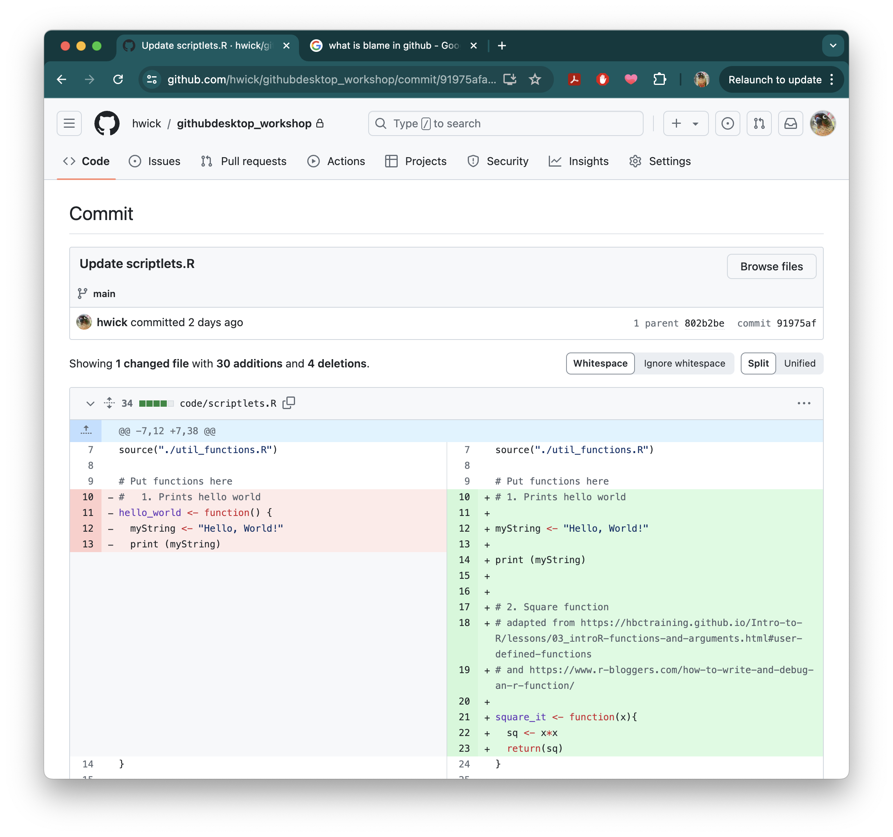
</p>


To return to your `main` branch, simply click the name of the repository at the very top of the screen. You'll know you're back in `main` because it will be displayed in the upper left above your folders and files.

***

* Materials used in these lessons are derived from Daniel van Strien's ["An Introduction to Version Control Using GitHub Desktop,"](http://programminghistorian.org/lessons/getting-started-with-github-desktop), Programming Historian, (17 June 2016). [The Programming Historian ISSN 2397-2068](http://programminghistorian.org/), is released under the [Creative Commons Attribution license](https://creativecommons.org/licenses/by/4.0/) (CC BY 4.0).*

* Materials are also derived from [Software Carpentry instructional material](https://swcarpentry.github.io/git-novice/). These materials are also licensed under the [Creative Commons Attribution license](https://creativecommons.org/licenses/by/4.0/) (CC BY 4.0).*
