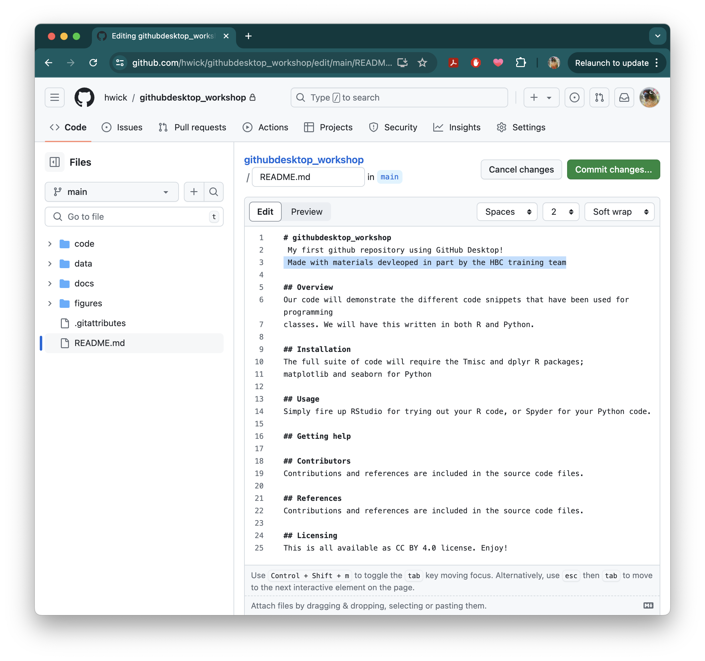
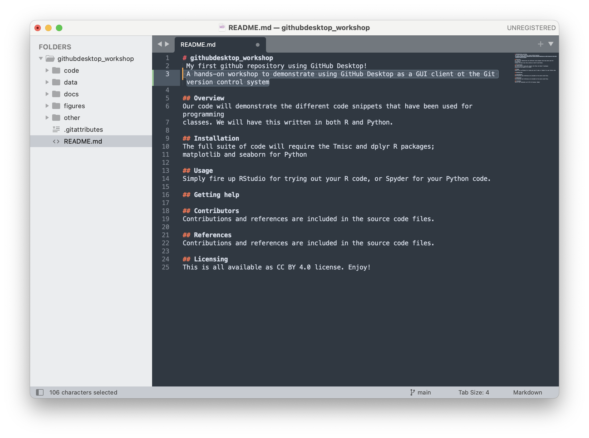
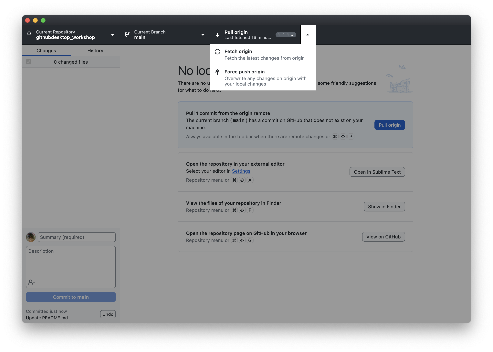
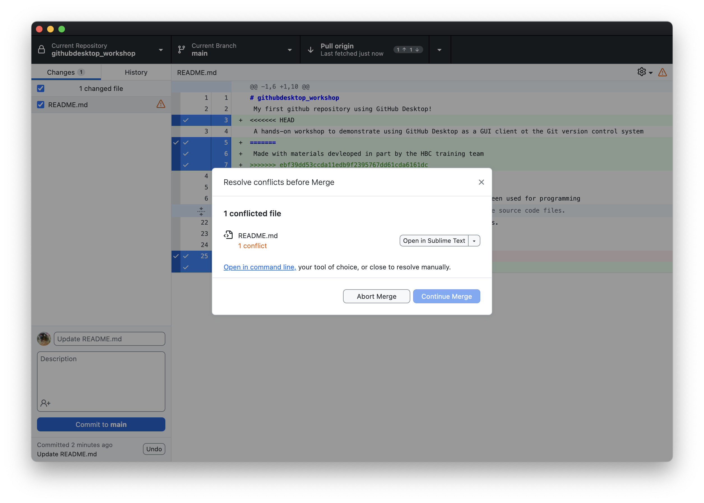
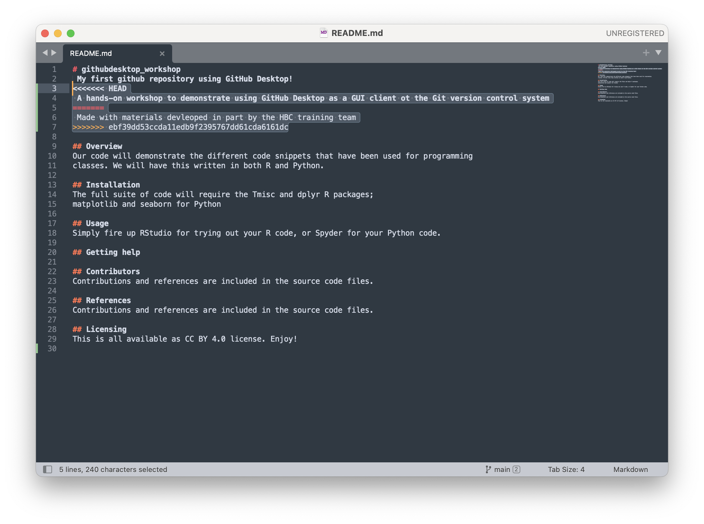
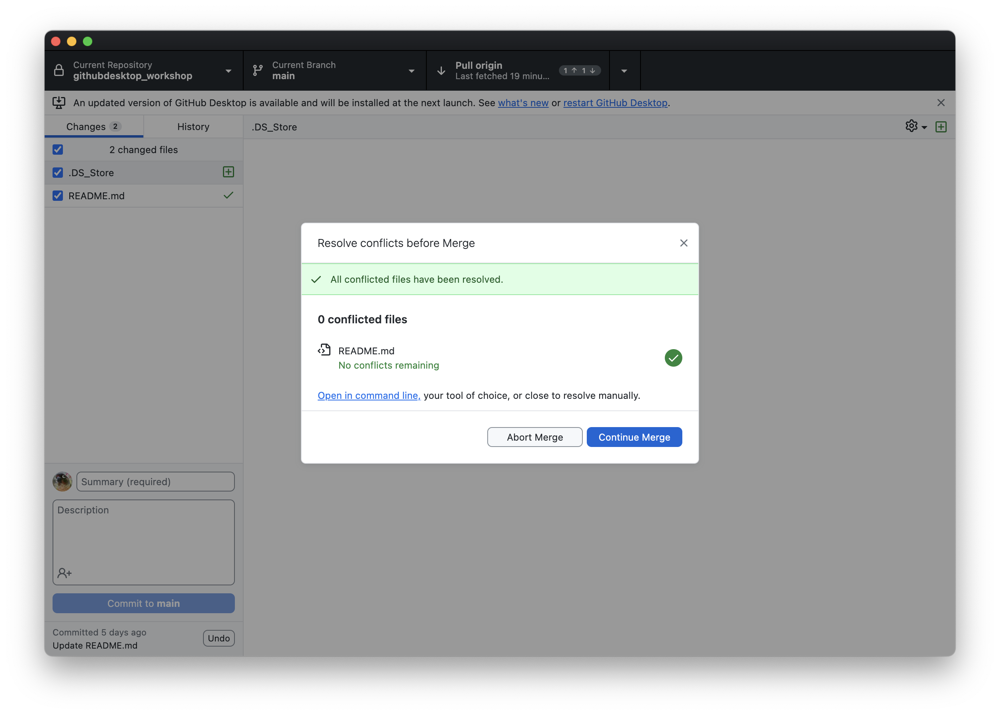
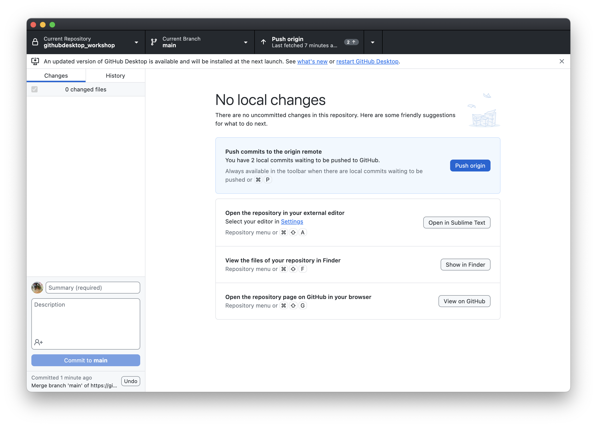
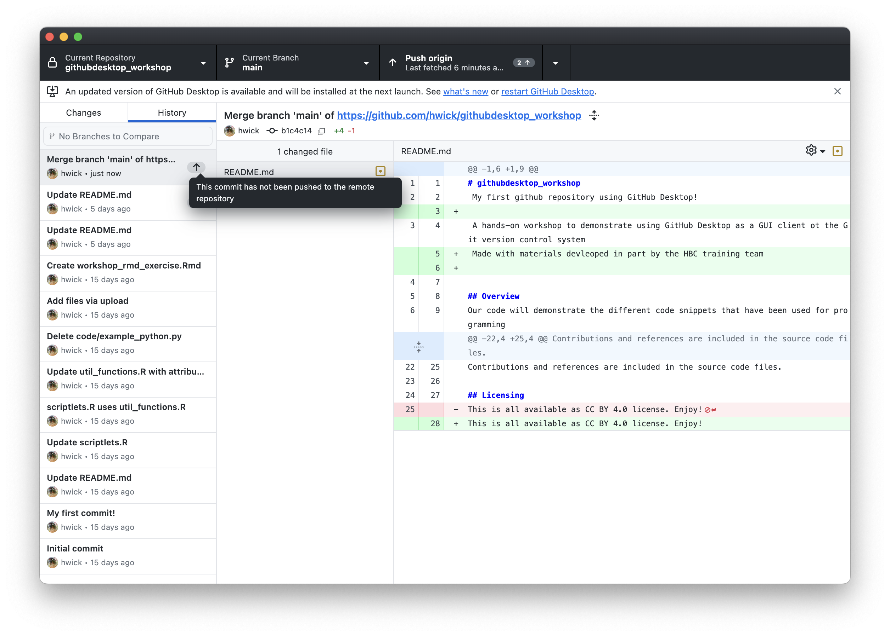

## Learning objectives
* Manage conflicts in git repositories

## Managing Conflicts

A **conflict** emerges when you try to merge (sync) two versions of a document with changes which conflict with each other. If you are careful about committing and syncing then it is unlikely you will run into this issue; but if you do, it can be resolved fairly easily.

The most likely way a conflict will emerge is if you, or if you are sharing your repo with a collaborator, make a change on either the local or online repo, and then make a subsequent change on the other without first syncing the changes.

If you make changes in different parts of a file or within the repo, these changes can be merged (synced) together without any conflict. But if these changes conflict with one another – if you try and change the same line of the document in two different ways – that's when there is an issue, as Git will not know which change is the one you wish to keep.


An example will help illustrate the most likely way conflicts can emerge, and how to deal with them. 

Let's add a change to our remote repository to main documentation `README.md` file. Let's add an attribution under the main header:

```
Made with materials devleoped in part by the HBC training team
```



Commit this change on Github! 

Now let's move back to GitHub Desktop. You'll noticed that the righthand button of the repository bar will say something like `Pull Origin` with the number `1` and a downward pointing arrow, and might say something like `last fetched a moment ago`. You'll aslo see a highlighted blue box saying **"Pull 1 commit from the origin remote** The current branch (`main`) has a commit on GitHub that does not exist on your machine" and a blue button that says `Pull Origin`. This is GitHub Desktop's way of allerting you that there is a remote change that you can incorporate locally, but **ignore the prompt to pull for now**. Instead, we will make a different change to the same document locally. Click the button to open the repot in `Sublime Text` (or your text editor of choice), click on the readme, and add the following line to the header:

```
 A hands-on workshop to demonstrate using GitHub Desktop as a GUI client ot the Git version control system
```



Save the changed file. Return to GitHub Desktop which should already show the change, add a description, and Commit:


You'll now notice that the righthand button in the repository has changed, and now shows both down- and up-pointing arrows, indicating you have changes to either push or pull. If you click on the triangle for this button, you'll see you have 3 options: `pull`, `fetch`, or `force push origin`. Note that **if you `force push origin`, you will overwrite and lose any independent changes to your remote repository (`origin`)**. That's one way to manage a conflict. But **what if we want to keep both changes?** In that case, we want to `pull` first:
 

 
If you click `pull`, you will get a popup indicating there is a conflicted file. you'll have the option to open it in a text editor or command line (which will show you the conflicts and let you resolve manually), or you can `Abort Merge` to undo the pull entirely. Note that `Continue Merge` is greyed out -- you'll have to resolve the conflict manually first!



This is not a big problem: What Git is aking you to do is manage these conflicts. GitHub Desktop offers you the option of opening the file with the sync conflicts.


If you select the drop down menu attached to the option to open in the text editor, you'll see several options, including simply opening in the text editor, showing the file in `Finder`, or choosing a specific version of the file: `Use the modified file from main` (local) or `Use the modified file from origin/main` (remote).


Let's open the file with an external text editor (the document will open with whichever text editor/application we have chosen as the default for opening Markdown files). 

Looking at the file, we will see Git has denoted the conflicting section (selected here):



This conflicting section is marked with `<<<<<<<` and ends with `>>>>>>>`. These are known as the **conflict markers**. The two conflicting blocks are divided by a `=======` line. 

There are a number of approaches to dealing with a conflict:

* You could choose to go with either of the changes by deleting the version you no longer want and removing the conflict markers (or by selecting which version you want through the dropdown menu we saw previously), OR

* You could change the section entirely and not choose either of the options, OR

* You could keep both of the versions

Whichever option you choose, you must **remove** the conflict markers in order to proceed. We're going to keep both edits, as it is more informative. Once you have *resolved* the conflict, save the file, and then go back to GitHub Desktop. You'll see that it's noticed the conflict has been resolved, and now you will be able to click **`Continue Merge`**:



Now you'll see that there are no more local changes; you'll also see the commit message in the lower left hand corner. And you'll also see a highlighted blue box prompting you to push your 2 local commits to origin:



If you click the `History` tab, you can see the changes you made, and also an up arrow under the commit message on the left hand side, also prompting you to push to the remote repository:



Now, synchronize your local changes by the standard workflow of **Pull and Push** and your local and remote repositories will be in sync:


This may seem like a convoluted approach to dealing with conflicts, but it is very useful as you have total control and the last word in dealing with conflicts. In contrast, if conflicts emerge on a system like Dropbox, the result is two files being created: Although this is better than potentially losing important changes, it also means you still have to look at these two documents and decide how you are going to merge them. 

If you are careful about always syncing changes you will be able to avoid having to deal with conflicts. When collaborating, the likelihood for conflicts increases; so, it is useful to be aware of how to deal with conflicts before you begin to collaborate using GitHub. 

***

**Exercise #3**

1. For the "learning_github" repo you generated earlier, create a conflict within the "data-file.txt" file by making changes locally and remotely.
2. Resolve the conflict and commit.

***

* Materials used in these lessons are derived from Daniel van Strien's ["An Introduction to Version Control Using GitHub Desktop,"](http://programminghistorian.org/lessons/getting-started-with-github-desktop), Programming Historian, (17 June 2016). [The Programming Historian ISSN 2397-2068](http://programminghistorian.org/), is released under the [Creative Commons Attribution license](https://creativecommons.org/licenses/by/4.0/) (CC BY 4.0).*

* Materials are also derived from [Software Carpentry instructional material](https://swcarpentry.github.io/git-novice/). These materials are also licensed under the [Creative Commons Attribution license](https://creativecommons.org/licenses/by/4.0/) (CC BY 4.0).*
