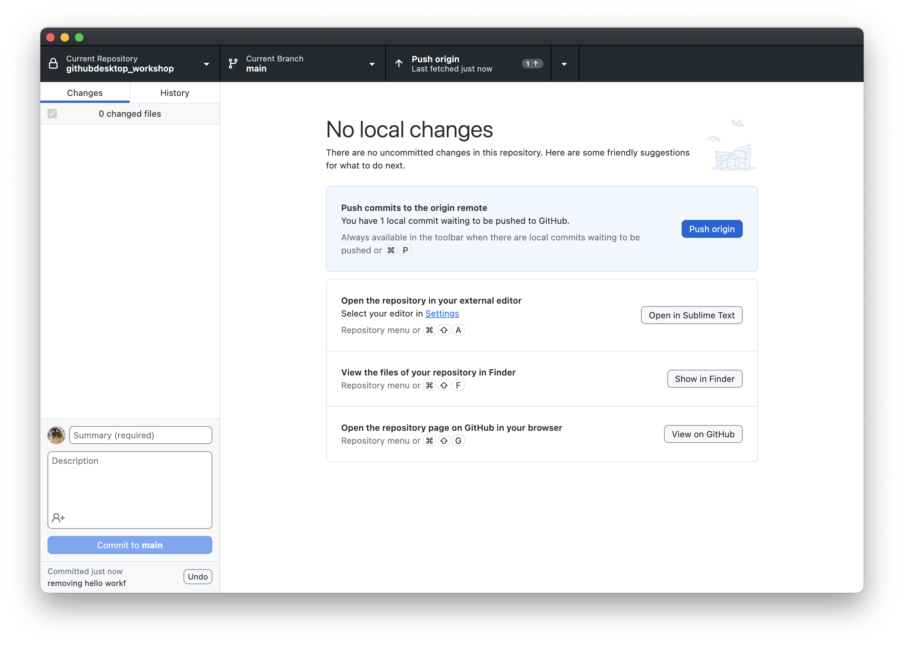
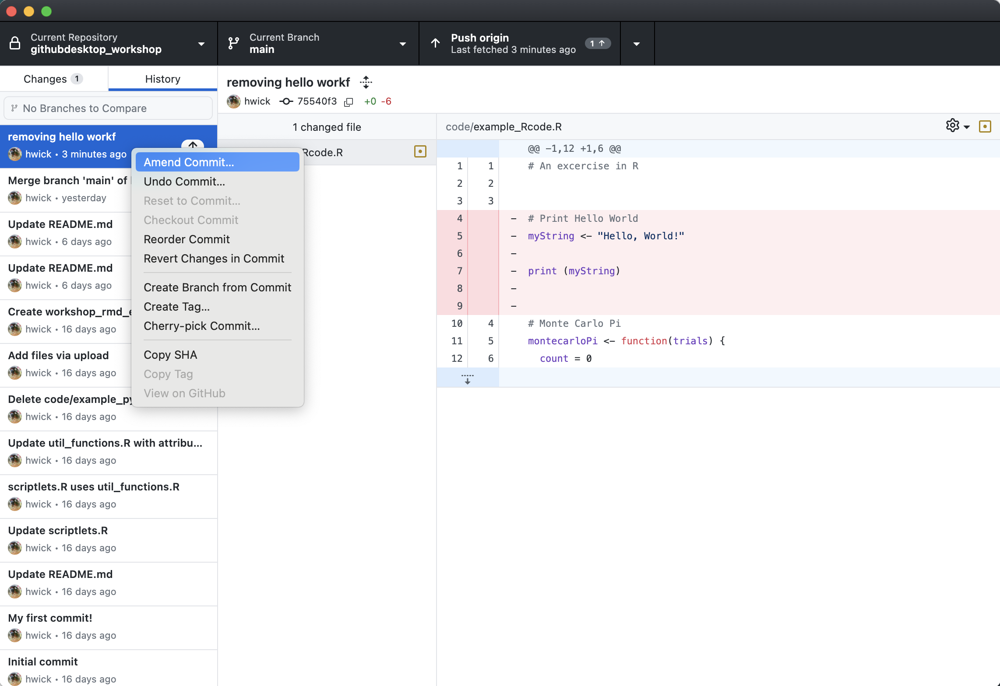
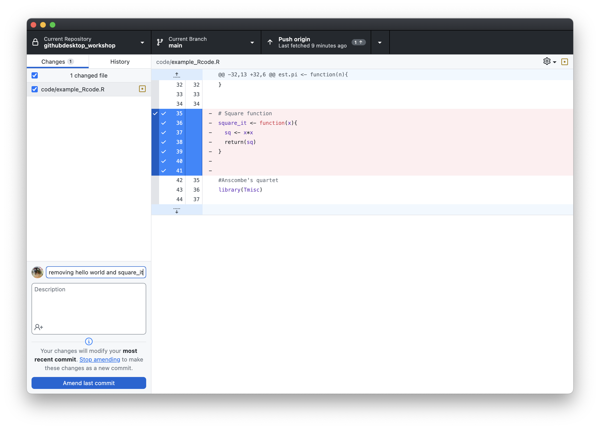
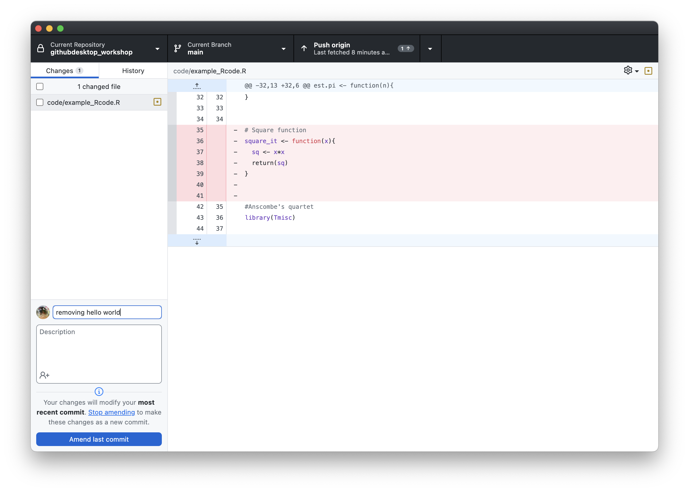
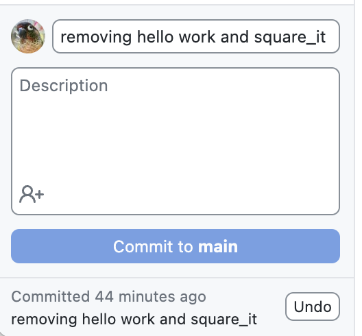
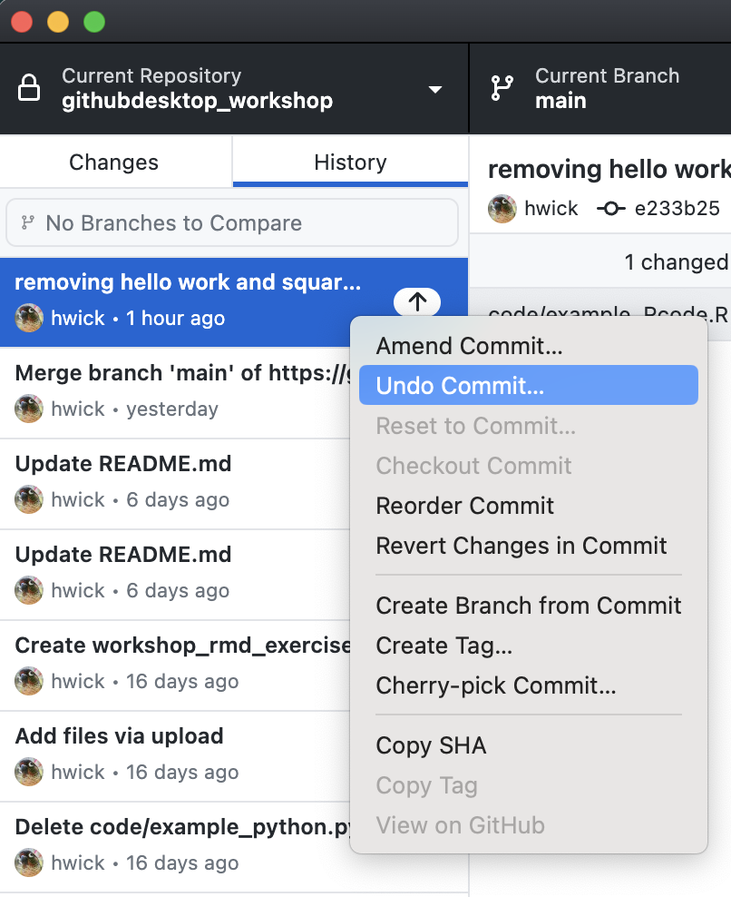
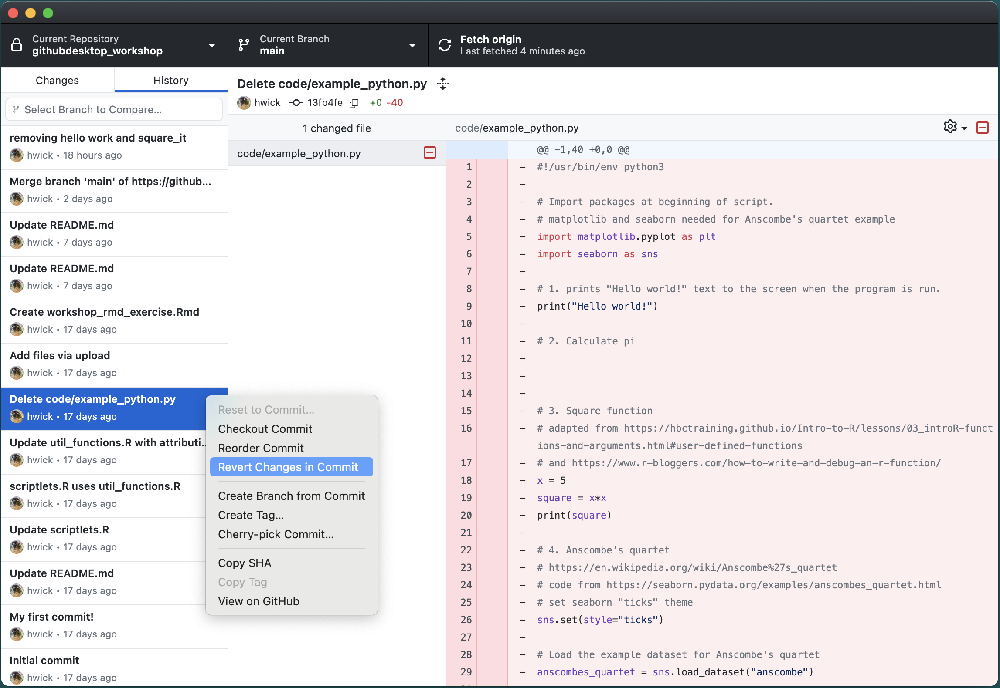
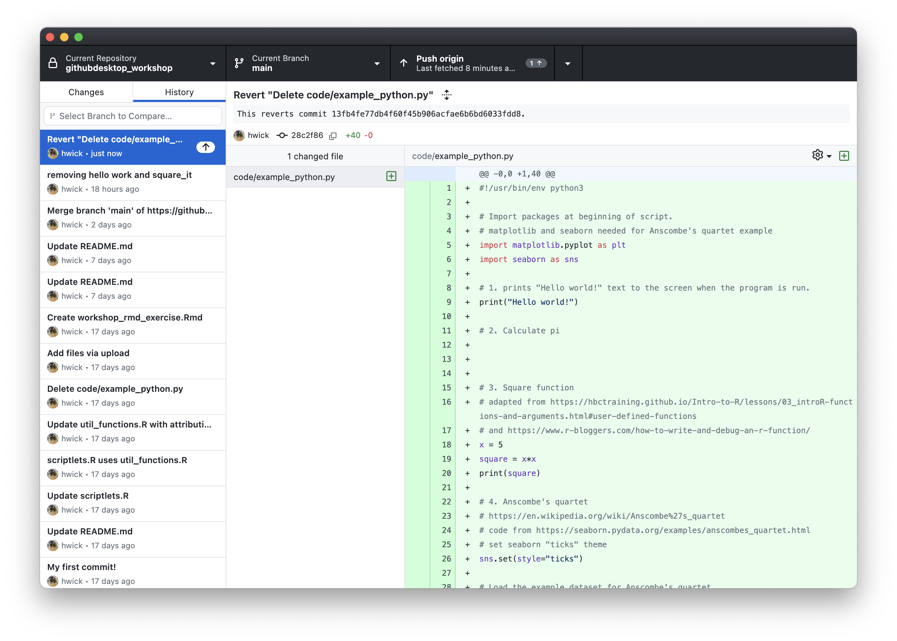
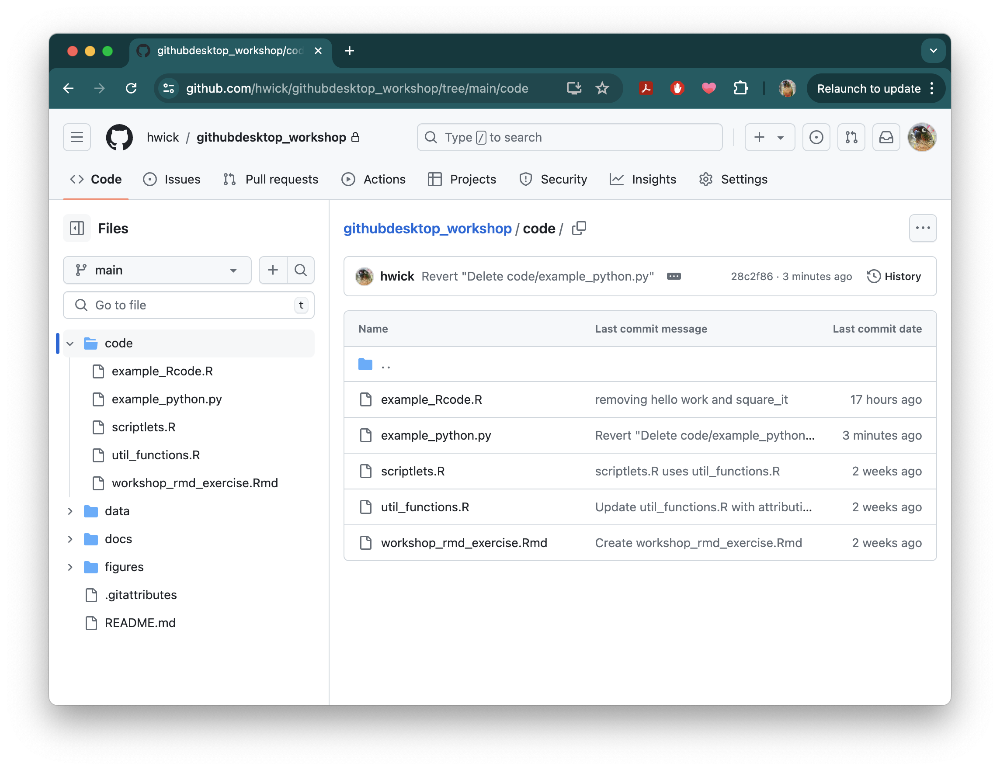

## Learning Objectives:
- Learn how to amend a commit
- Learn how to revert a commit

## Working with Commits

Sometimes a simple commit isn't that simple: you've forgotten something, you need to undo what you've done, or you need to go back to something you committed some time ago. This section with help you navigate these items.

## Amending Commits

Oops! Pushed 'Commit' button too fast? 

Perhaps you noticed errors in your commit message, or decided it was not worded correctly. Or maybe you wanted to make a few changes to the file before you had gone ahead and pressed commit. Good news! As long as you have not updated any remotes, you can amend the last commit message, add additional changes, or both. To do this you need to first make some changes in your repo. Open up your `example_Rcode.R`, and remove the "Hello world!" chunk of code and save. 

Now stage the change, and commit with a message.

  

Oh no! There is a typo in our commit message. Also we realized that we should have also removed the `square_it` code. Open up your `example_Rcode.R` again, and this time remove the chunk of code for `square_it` and save the file again. 

Now go back to your GitHub Desktop window and click history tab and right click the most recent commit, and select the "Amend commit" from the drop down menu:

  

You'll note that the previous commit message is copied into the Message and Description fields. This is your chance to edit the commit message you previously made a typo on. And you can amend the commit with additional changes, which we did by removing additional code: 

  

If you wish to amend the message only, simply uncheck the box under `1 changed file`:

  

Go ahead and decide if you would like to include the new change and fix the description summary, click **`Commit to main`**, and don't forget to **`Push origin`** so that your changes appear on your repository on GitHub.

## Undoing, Resetting, and Reverting Commits

Sometimes you just want to **undo** the last thing you did. Maybe that last change you made (e.g. commit, branch, etc) was something you didn't mean to make. GitHub Desktop has a convenient `Undo` button in the lower left next to the name of the latest commit you made. You might have also noticed an `Undo Commit` option in the drop down menu when we right clicked our most recent commit from the history tab.

  
&nbsp; &nbsp; &nbsp; &nbsp;
  

You'll notice some other options in the dropdown menu. For example, you can also **`Reset to Commit`**. This will undo every recent commit up to that commit. It is greyed out from the menu above because undoing that commit is equivalent, but you'll notice it's an option for older commits. Be careful with this option, because it will undo everything you've changed since then.

Another option available is to **`Revert Changes in Commit`**. This will create a new commit to undo the changes unique to that commit, while keeping any changes made in more recent commits. This is useful if you want to undo the change in that commit but keep all the changes you've made since that commit.

## Reverting Changes in Commits: an example

At times, there may be the need to go back in history to a previous commit: perhaps you wish to retrieve files that you've deleted or changed, or perhaps you wish to inspect the state of your project and code to inform current work. No matter what it is, like a time machine, Git allows you to move the pointer on your repo to any commit, and it will likewise change the repo files and structure to reflect that.

We realized that deleting all of the Python script (in the [the previous lesson](06_Github_remote2.md)) was a big mistake. We actually need that code for a subset of our analyses!

Now, we want it back. If we go to the `History` tab in GitHub Desktop and right-click on the commit where we deleted `code/example_python.py`, "Delete code/example_python.py", we see the option to `Revert Changes in Commit`:

  

If you select that, GitHub Desktop will immediately make a new commit, called `Revert Delete code/example_python.py` with a changed file all in green -- that's because we're adding that file back in after deleting it in that older commit:

Go ahead and `Push to origin` and then go back to your GitHub repo. Voila! `code/example_python.py` has been restored!

  

### Cheatsheet: Other Options in the dropdown menu

You may have noticed there are several other options in the dropdown menu when right-clicking commits. Here's a quick overview of what those options do:

**Reorder Commit** - This lets you move a commit to earlier or later in the history. Once selected, you can use your keyboard's up and down arrows to place the commit in its new location in the timeline, using `enter`/`return` to confirm, or `esc` to exit without changing the order.

**Checkout Commit** - This lets you look at the repo at the time this commit was made, in a new, `detached HEAD` (similar to a branch, which we'll cover later). This can be useful for looking at old code, but it is also a bit risky to create a `detached HEAD` because commits made here won't be able to be merged back to `main`.

**View on GitHub** - This will open the changes you made in this commit on GitHub

We will discuss branches more in the next lesson, but the last two options relate to branches:

**Create Branch from Commit** - This will create a new branch, separate from `main`, in your repository starting from this commit. 

**Cherry Pick Commit** - This will let you take a commit from one branch and transfer it to another branch. This is a great option if you want to merge specific changes from particular branches to main without merging the whole branch.

---

* Materials used in these lessons are derived from Daniel van Strien's ["An Introduction to Version Control Using GitHub Desktop,"](http://programminghistorian.org/lessons/getting-started-with-github-desktop), Programming Historian, (17 June 2016). [The Programming Historian ISSN 2397-2068](http://programminghistorian.org/), is released under the [Creative Commons Attribution license](https://creativecommons.org/licenses/by/4.0/) (CC BY 4.0).*

* Materials are also derived from [Software Carpentry instructional material](https://swcarpentry.github.io/git-novice/). These materials are also licensed under the [Creative Commons Attribution license](https://creativecommons.org/licenses/by/4.0/) (CC BY 4.0).*

* Materials are also derived from [GitKraken Support for Git Client](https://support.gitkraken.com/start-here/interface/) on GitKraken's website. 
