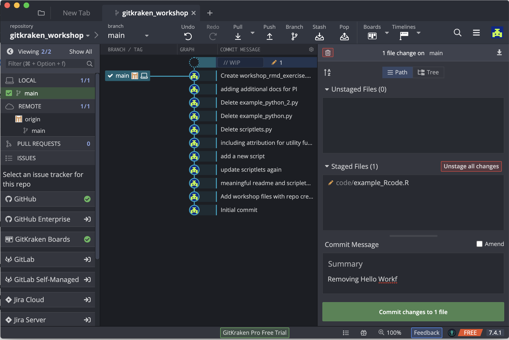
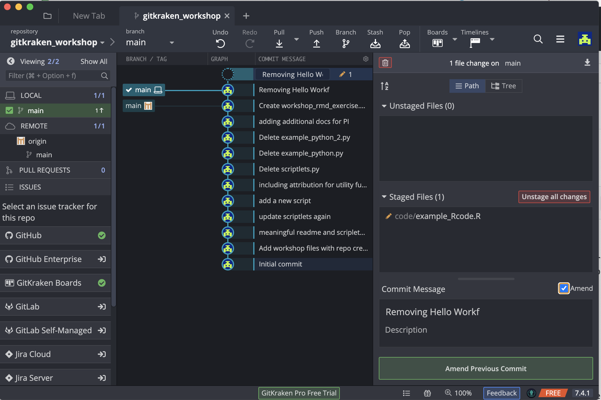
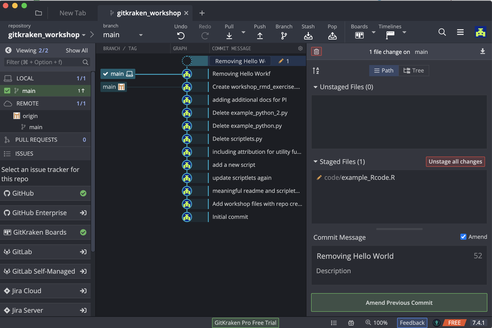
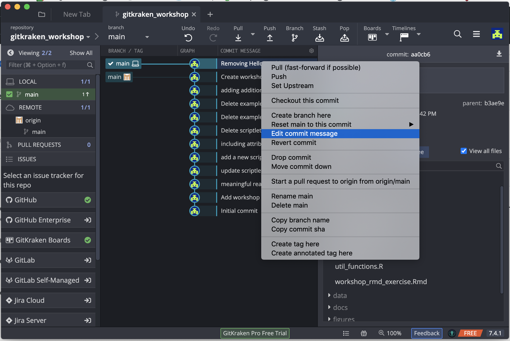

## Learning Objectives:
- Learn how to amend a commit
- Learn how to revert a commit

## Working with Commits

Sometimes a simple commit isn't that simple: you've forgotten something, you need to undo what you've done, or you need to go back to something you committed some time ago. This section with help you navigate these items.

## Amending Commits

Oops! Pushed 'Commit' button too fast? 

Perhaps you noticed errors in your commit message, or decided it wa not worded correctly. Or maybe you wanted to make a few changes to the file before you had gone ahead and pressed commit. Good news! As long as you have not updated any remotes, you can amend the last commit message, add additional changes, or both. To do this you need to first make some changes in your repo. Open up your `example_R_code.R`, and remove the "Hello world!" chunk of code and save. 

Now stage the change, and commit with a message.

Oh no! There is a typo in our commit message. Also we realized that we should have also removed the `square_it` code. Open up your `example_R_code.R` again, and this time remove the chunk of code for `square_it`. 

Now go back to your GitKraken window and click on the //WIP node on the graph. Stage the file you would wish to include in the updated commit, and select the "Amend" checkbox in the Commit Message pane:

You'll note that the previous commit message is copied into the Message and Description fields. This is your chance to edit the commit message you previously made a typo on. And you can amend the commit with additional changes, which we also did by removing additional code.

The commit button is titled Amend Previous Commit instead. 

If you wish to amend the message only, hover over and click on the commit message. If you right click you get the option to "Edit commit message".

## Reverting Commits

Sometimes you just want to undo the last thing you did. Like that last change (e.g. commit, branch, etc) you didn't mean to make? GitKraken's Undo button in the top toolbar will let you undo most actions (which can also Redo if needed!). Hover over the Undo button to see what action it will take, and click if that seems appropriate:

If the Undo option is not available or not appropriate, one can use the Revert Commit option for the latest commit or even a previous one. This will not only bring back the changes to your working directory, but will include an explicit commit to document that this change to the repo. To perform this, click on the commit node, and right-mouse click to see the popup menu. From there, select the Revert Commit option:

  
When prompted, you can immediate commit this explicit change, or keep the changes as a WIP (work in progress) for you to do additional work. Clicking Yes enters the new commit to your repo:

* Materials used in these lessons are derived from Daniel van Strien's ["An Introduction to Version Control Using GitHub Desktop,"](http://programminghistorian.org/lessons/getting-started-with-github-desktop), Programming Historian, (17 June 2016). [The Programming Historian ISSN 2397-2068](http://programminghistorian.org/), is released under the [Creative Commons Attribution license](https://creativecommons.org/licenses/by/4.0/) (CC BY 4.0).*

* Materials are also derived from [Software Carpentry instructional material](https://swcarpentry.github.io/git-novice/). These materials are also licensed under the [Creative Commons Attribution license](https://creativecommons.org/licenses/by/4.0/) (CC BY 4.0).*

* Materials are also derived from [GitKraken Support for Git Client](https://support.gitkraken.com/start-here/interface/) on GitKraken's website. 
