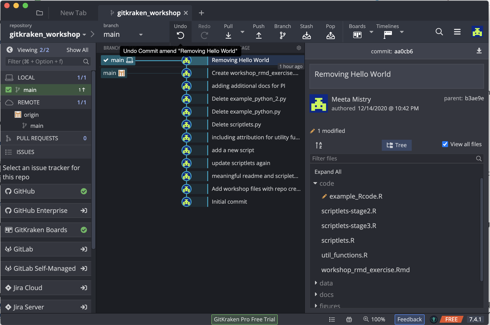
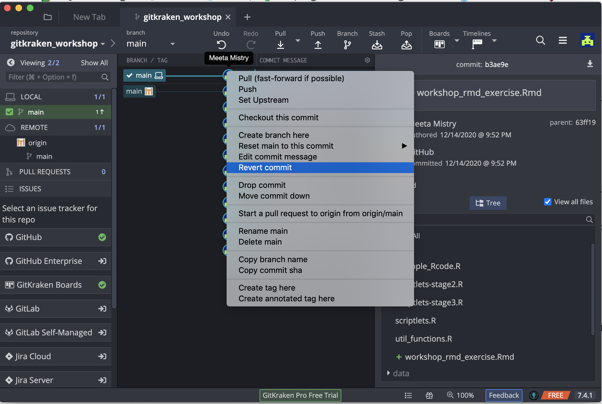
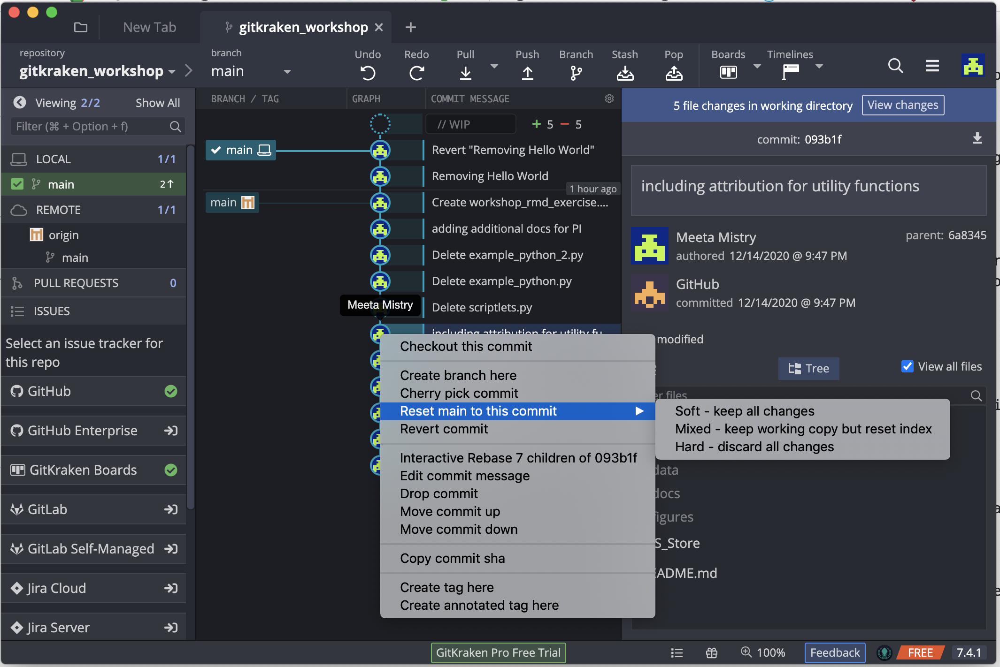
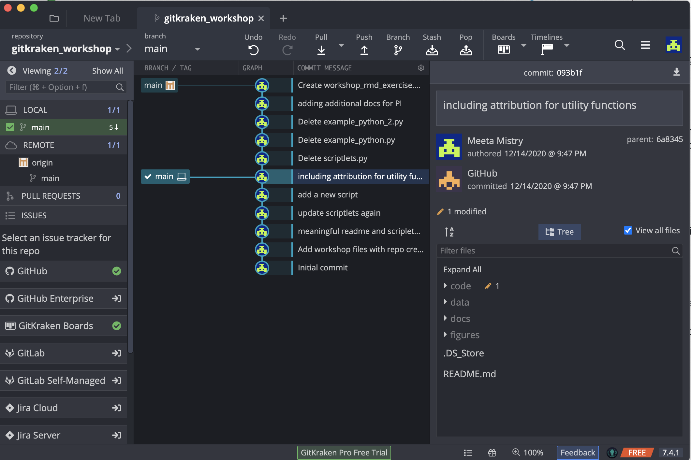

## Learning Objectives:
- Learn how to amend a commit
- Learn how to revert a commit

## Working with Commits

Sometimes a simple commit isn't that simple: you've forgotten something, you need to undo what you've done, or you need to go back to something you committed some time ago. This section with help you navigate these items.

## Amending Commits

Oops! Pushed 'Commit' button too fast? 

Perhaps you noticed errors in your commit message, or decided it wa not worded correctly. Or maybe you wanted to make a few changes to the file before you had gone ahead and pressed commit. Good news! As long as you have not updated any remotes, you can amend the last commit message, add additional changes, or both. To do this you need to first make some changes in your repo. Open up your `example_R_code.R`, and remove the "Hello world!" chunk of code and save. 

Now stage the change, and commit with a message.

Oh no! There is a typo in our commit message. Also we realized that we should have also removed the `square_it` code. Open up your `example_R_code.R` again, and this time remove the chunk of code for `square_it`. 

Now go back to your GitKraken window and click on the //WIP node on the graph. Stage the file you would wish to include in the updated commit, and select the "Amend" checkbox in the Commit Message pane:

You'll note that the previous commit message is copied into the Message and Description fields. This is your chance to edit the commit message you previously made a typo on. And you can amend the commit with additional changes, which we also did by removing additional code.

The commit button is titled Amend Previous Commit instead. 

If you wish to amend the message only, hover over and click on the commit message. If you right click you get the option to "Edit commit message".

## Reverting Commits

Sometimes you just want to undo the last thing you did. Maybe that last change you made (e.g. commit, branch, etc) was something you didn't mean to make. GitKraken's Undo button in the top toolbar will let you undo most actions (which can also Redo if needed!). 

Hover over the Undo button to see what action it will take:

Looks like, if we wanted, we could undo the Amend Commit that we just did. This would revert us back to the original commit with only the "Hello World" code removed (and the typo in the commit message).

If the Undo option is not available or not appropriate, one can also use the Revert Commit option. This allows you to not only undo the latest commit but it can also revert back to an older previous commit (that may have happened many commits before the last one). This will not only bring back the changes to your working directory, but will include an explicit commit to document this change to the repo. 

To perform this, click on the "Removing Hello World" commit node, and right-mouse click to see the popup menu. From there, select the Revert Commit option:

  
When prompted, you can immediate commit this explicit change, or keep the changes as a WIP (work in progress) for you to do additional work. Clicking Yes enters the new commit to your repo. Take a look at the `example_Rcode.R` file. You should see that it is how it was, when we first started this lesson.

## Resetting (Checking Out Previous) Commits

At times, there may be the need to go back in history to a previous commit: perhaps you wish to retrieve files that you've deleted or changed, or perhaps you wish to inspect the state of your project and code to inform current work. No matter what it is, like a time machine, Git allows you to move the pointer on your repo to any commit, and it will likewise change the repo files and structure to reflect that.

We realized that deleting all of those Python scripts (in the [self-learning lesson](06_Github_remote2.md)) was a big mistake. We actually need that code for a subset of our analyses!

Now, we want those back. Working with a previous commit will help us here. If we right-click on the commit where right before we deleted the first file, "including attribution for utility functions", we have an option to "Reset master to this commit", with three options: soft, mixed, and hard:

The 'soft' option allows us to keep any changes. Although this may seem the safest option, one could run into problems if there are files that overlap or change over time. We don't want any conflicts so we will go with the 'hard' option. Once you select this, note that the "main" node has moved down to the older commit. Ifyou open up your finder window and look inside the code folder you will now see the Python files

> **NOTE:** The 'hard' option seems extreme, discarding all of our changes. If we had been working on the repo and had some changes staged, this would be problematic. We wouldn't want to risk totally losing everything, if we potentially wanted to come back. In this scenario you would want to consider the [stash](https://support.gitkraken.com/working-with-commits/stashing/) option before choosing the 'hard' reset.

---

* Materials used in these lessons are derived from Daniel van Strien's ["An Introduction to Version Control Using GitHub Desktop,"](http://programminghistorian.org/lessons/getting-started-with-github-desktop), Programming Historian, (17 June 2016). [The Programming Historian ISSN 2397-2068](http://programminghistorian.org/), is released under the [Creative Commons Attribution license](https://creativecommons.org/licenses/by/4.0/) (CC BY 4.0).*

* Materials are also derived from [Software Carpentry instructional material](https://swcarpentry.github.io/git-novice/). These materials are also licensed under the [Creative Commons Attribution license](https://creativecommons.org/licenses/by/4.0/) (CC BY 4.0).*

* Materials are also derived from [GitKraken Support for Git Client](https://support.gitkraken.com/start-here/interface/) on GitKraken's website. 
